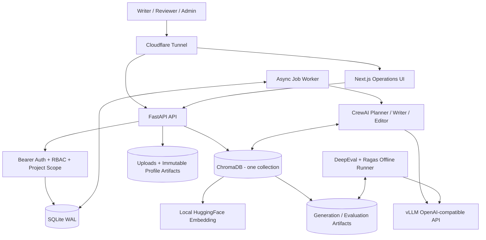
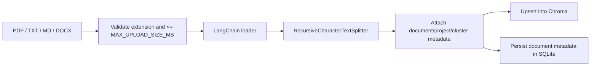
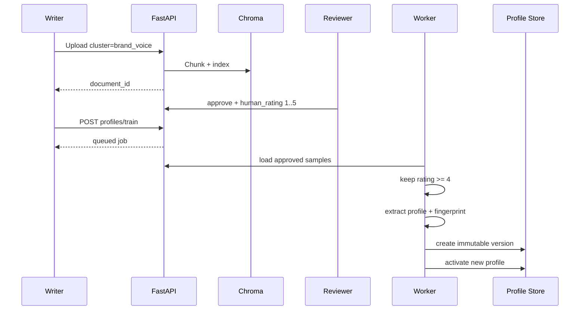
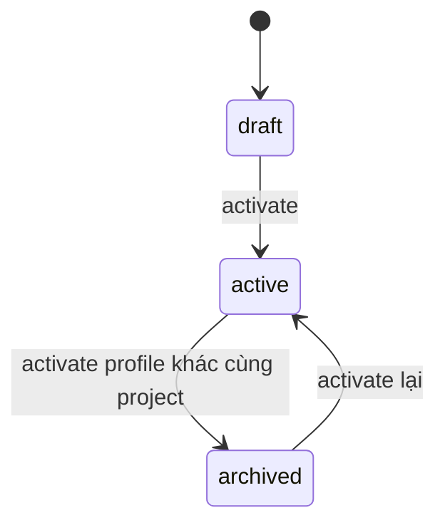
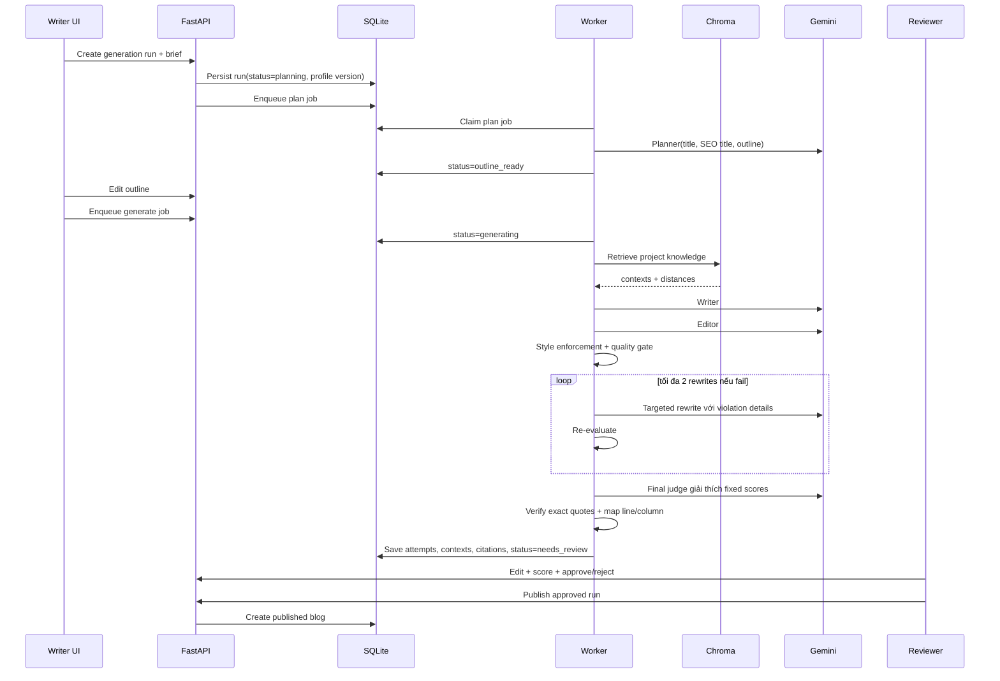
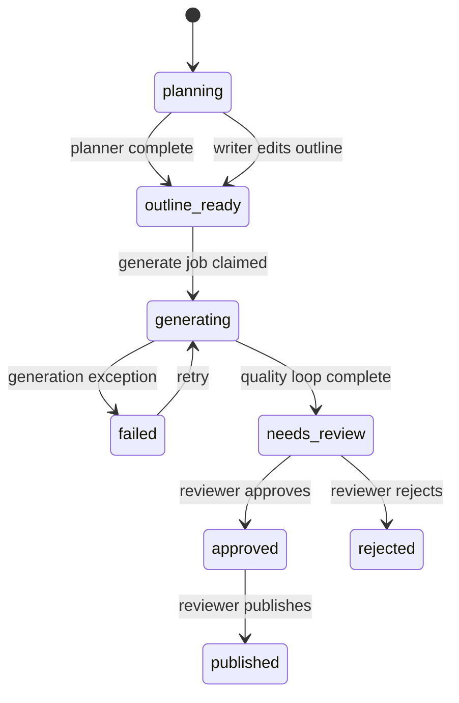
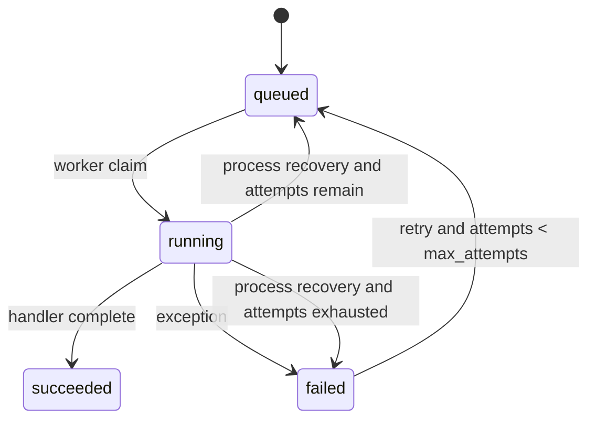
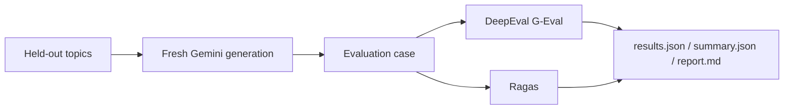

# AI Content OS - Pipeline, Workflow, Architecture and Evaluation

> Phiên bản tài liệu: 2026-08-15
> Phạm vi: implementation hiện tại trong `backend/`, `frontend/` và các script evaluation.
> Mục tiêu: mô tả chính xác hệ thống đang chạy, cách dữ liệu đi qua pipeline, cách tính từng metric và điều kiện để một bài được publish.

## Mục lục

- [1-3. Tổng quan và kiến trúc](#1-tóm-tắt-hệ-thống)
- [4. Kiến trúc dữ liệu](#4-kiến-trúc-dữ-liệu)
- [5. Workflow Brand Voice](#5-workflow-quản-lý-brand-voice)
- [6-7. Workflow và state machines](#6-workflow-tạo-blog)
- [8. Runtime metrics và quality gate](#8-runtime-metrics-và-quality-gate)
- [9-12. DeepEval, Ragas và batch aggregation](#9-offline-evaluation-architecture)
- [13. Kết quả đo hiện tại](#13-current-measured-evidence)
- [14-15. API, role và operations](#14-api-workflow-và-role-matrix)
- [16-18. Failure modes, giới hạn và release gates](#16-failure-modes-và-cách-đọc-metric)
- [19-21. Cách chạy, traceability và Definition of Done](#19-cách-chạy-và-lưu-bằng-chứng)

## 1. Tóm tắt hệ thống

AI Content OS là hệ thống viết blog theo project, dùng ba nguồn tín hiệu độc lập:

1. **Brief của người dùng** xác định bài cần viết gì.
2. **Knowledge documents** cung cấp dữ kiện để bài không tự bịa.
3. **Brand voice samples** cung cấp cách viết, giọng điệu và writing fingerprint.

Trên database sạch, bootstrap mặc định nạp project `default`, 10 writing samples TSS đã approved và active profile `TSS Demo`. Vì vậy luồng demo bắt đầu trực tiếp từ bước nhập brief; có thể tắt bằng `DEMO_SEED_ENABLED=false`.

Luồng chính là:

```text
Upload dữ liệu
  -> phân cluster
  -> duyệt writing samples
  -> train và activate Brand Voice Profile
  -> nhập brief
  -> Planner tạo outline
  -> người dùng sửa outline
  -> retrieve knowledge
  -> Writer viết
  -> Editor biên tập
  -> deterministic enforcement
  -> quality gate
  -> tối đa 2 targeted rewrites
  -> human review
  -> publish
```

Generation mặc định dùng một model Qwen được phục vụ qua vLLM OpenAI-compatible API:

| Vai trò | Model mặc định | Trách nhiệm |
| --- | --- | --- |
| Planner | `qwen3.5-2b` | Tạo title, SEO title và outline có cấu trúc |
| Writer | `qwen3.5-2b` | Viết bài dựa trên brief, profile và knowledge context |
| Editor | `qwen3.5-2b` | Sửa cấu trúc, giọng văn, thuật ngữ và factual claims |
| Embedding | `sentence-transformers/all-MiniLM-L6-v2` | Embedding local cho ChromaDB |
| Final judge | `qwen3.5-2b` | Giải thích score và xác định exact quote cần highlight |

Generation model và embedding model được tách riêng. Đổi model phục vụ qua vLLM không yêu cầu re-index Chroma nếu embedding model không đổi.

## 2. Nguyên tắc kiến trúc

### 2.1 Tách “viết gì” và “viết như thế nào”

| Nguồn | Trả lời câu hỏi | Được dùng ở đâu |
| --- | --- | --- |
| Brief | Người dùng muốn bài gì? | Planner, Writer, Editor, quality gate |
| `knowledge` | Thông tin nào được phép dùng? | Retrieval, Writer, citations, Ragas |
| `brand_voice` | Nên diễn đạt theo phong cách nào? | Profile training, prompt, Brand Voice metrics |
| `evaluation` | Kết quả có tốt trên dữ liệu held-out không? | Benchmark offline, không dùng để generate |

Không dùng sample brand voice làm nguồn factual mặc định. Không dùng evaluation documents làm context generation.

### 2.2 Project isolation

Mọi document, profile, generation run và job đều có `project_id`. Retrieval thêm metadata filter theo ít nhất:

```text
project_id = project đang viết
cluster = knowledge
```

Authorization kiểm tra cả role và project scope. Token có thể được giới hạn vào một danh sách project hoặc `*`.

### 2.3 Human-in-the-loop

Automated quality gate không tự publish. Run luôn chuyển sang `needs_review`; reviewer có thể sửa nội dung, cho điểm, approve/reject và chỉ run `approved` mới publish được.

### 2.4 Versioning và traceability

Mỗi generation run lưu:

- `profile_id` và `profile_version` đã dùng.
- Brief và outline.
- Từng generation attempt.
- Model name và prompt version.
- Quality report của từng attempt.
- Retrieved contexts và citations.
- Nội dung cuối, reviewer, human score và review notes.
- Blog được publish từ run nào.

## 3. Sơ đồ kiến trúc tổng thể



### 3.1 Thành phần và ownership

| Thành phần | Module chính | Ownership |
| --- | --- | --- |
| HTTP/API | `backend/app/api/v1/` | Validate request, auth, enqueue job, trả resource |
| Business services | `backend/app/services/` | Ingestion, generation, Brand Voice, quality |
| Agent orchestration | `backend/app/crews/`, `agents/`, `tasks/` | Prompt và CrewAI sequencing |
| RAG | `backend/app/rag/`, `tools/knowledge_base_tool.py` | Chunk, embed, filter, retrieve |
| Persistence | `backend/app/repositories/`, `db/database.py` | SQLite state transitions và audit records |
| Background processing | `backend/worker.py`, `app/workers/` | Claim job, execute, retry, recover |
| Bootstrap data | `backend/app/bootstrap/`, `backend/seed/tss/` | Seed idempotent samples và active demo profile |
| Runtime UI | `frontend/app/` | Brief, source management, review, publish |
| Offline evaluation | `backend/app/evaluation/`, `backend/scripts/` | DeepEval, Ragas, benchmark artifacts |

## 4. Kiến trúc dữ liệu

### 4.1 Logical clusters trong ChromaDB

Hiện tại hệ thống dùng **một Chroma collection** tên mặc định `knowledge_hub`. Ba cluster là logical partition bằng metadata, không phải ba Chroma database vật lý.

| Cluster | Dữ liệu | Có vào generation context? | Có cần reviewer approve? |
| --- | --- | ---: | ---: |
| `knowledge` | Tài liệu sản phẩm, kiến thức, nguồn tham khảo | Có | Không bắt buộc trong code hiện tại |
| `brand_voice` | Blog mẫu dùng để học phong cách | Không trực tiếp | Có, rating phải từ 4/5 |
| `evaluation` | Reference/held-out test data | Không | Không dùng cho profile hoặc generation |

Metadata quan trọng trên mỗi chunk:

```json
{
  "document_id": "...",
  "filename": "...",
  "chunk_index": 0,
  "project_id": "tss",
  "cluster": "knowledge",
  "purpose": "knowledge",
  "profile_id": "optional"
}
```

### 4.2 Ingestion và chunking



Mặc định:

- `CHUNK_SIZE=1000` ký tự.
- `CHUNK_OVERLAP=200` ký tự.
- Separator ưu tiên: paragraph, newline, sentence, space, character.
- ID chunk: `{document_id}_{chunk_index}`.
- Upload hỗ trợ: `pdf`, `txt`, `md`, `docx`.

### 4.3 Retrieval

Chroma dùng cosine distance. API chuyển distance thành score hiển thị:

```text
relevance_score = 1 - cosine_distance
```

Score này chỉ dùng để xếp hạng và hiển thị; nó chưa được calibration thành xác suất đúng.

Generation thực hiện hai kiểu retrieval:

1. **Pre-retrieval**: query bằng `selected_title + keywords`, lấy `top_k=2`, inject tối đa 3.000 ký tự vào prompt và persist đầy đủ context để eval.
2. **KnowledgeBaseTool**: Writer có thể tự search thêm, mặc định `top_k=5` mỗi lần tool call.

Mọi generation retrieval ép `cluster=knowledge` và `project_id` của run.

### 4.4 SQLite data model

| Bảng | Chức năng |
| --- | --- |
| `projects` | Project boundary |
| `documents` | Metadata, cluster, approval, rating, dataset split |
| `brand_voice_profiles` | Profile versioned, active/draft/archived, artifact path |
| `jobs` | Queue, attempts, idempotency, result/error |
| `generation_runs` | Brief, profile snapshot ID/version, state, final output, review |
| `generation_attempts` | Nội dung và quality report của từng attempt |
| `generation_citations` | Citation được gắn với run |
| `generation_retrieval_contexts` | Full retrieved chunks theo rank để audit/Ragas |
| `blogs` | Draft/published blog và liên kết về generation run |
| `brand_voice_reviews` | Automated và human Brand Voice review |
| `evaluation_runs` | Metadata một batch evaluation |
| `evaluation_items` | Kết quả từng case trong evaluation run |

Hai bảng `evaluation_*` đã có trong schema, nhưng `run_advanced_evaluation.py` hiện đọc/ghi JSON artifacts trực tiếp và chưa persist batch DeepEval/Ragas vào hai bảng này.

SQLite chạy WAL mode. Job worker dùng `BEGIN IMMEDIATE` để claim một queued job atomically.

### 4.5 Artifact files

| Artifact | Vị trí mặc định |
| --- | --- |
| SQLite | `backend/data/blog_os.db` |
| Chroma | `backend/data/chroma/` |
| Upload | `backend/data/uploads/` |
| Immutable profile | `backend/data/brand_voice/profiles/{project}/{profile}/profile.json` |
| SFT/DPO profile datasets | Cùng thư mục immutable profile |
| Generation benchmark | `backend/data/eval/tss_generation_*/` |
| Advanced evaluation | `backend/data/eval/advanced_*/` |

## 5. Workflow quản lý Brand Voice



### 5.1 Eligibility rule

Một writing sample được dùng train khi đồng thời:

```text
document.project_id == target project
document.cluster == brand_voice
document.approval_status == approved
document.human_rating >= 4
```

Mặc định cần ít nhất 5 và tối đa 30 documents. UI hiện approve sample với rating 5.

### 5.2 Profile output

Profile chứa tối thiểu:

- Brand identity: mission, positioning, personality, differentiators.
- Audience personas và decision criteria.
- Tone profile.
- Vocabulary: repeated terms, preferred phrases, forbidden terms.
- Dictionary: allowed terms và required replacements.
- Presentation và channel guidelines.
- Do/don't examples và rubrics.
- Writing fingerprint.
- Governance/reviewer checklist.
- Source document IDs và version.

### 5.3 Writing fingerprint được học

Cho `S` là số câu và `W` là số từ:

| Feature | Công thức hiện tại |
| --- | --- |
| Average sentence words | `sum(words_per_sentence) / S` |
| Short fragment ratio | `số câu 2-4 từ / S` |
| Rhetorical question ratio | `số câu kết thúc bằng ? / S` |
| Dash per 1.000 words | `dash_count / W * 1000` |
| Parenthetical aside ratio | `số cụm (...) / S` |
| Active voice ratio | `1 - passive_marker_sentences / S` |
| Punctuation per 1.000 words | `punctuation_count / W * 1000` theo từng loại |

`active_voice_ratio` là heuristic dựa trên marker bị động, không phải parser ngữ pháp đầy đủ.

### 5.4 Profile version lifecycle



Khi profile mới được tạo, version tăng theo `(project_id, profile name)`. Artifact profile được copy sang thư mục mới và không sửa profile cũ.

## 6. Workflow tạo blog

### 6.1 Brief contract

| Field | Rule |
| --- | --- |
| `topic` | 5-300 ký tự |
| `keywords` | 1-10 items |
| `audience` | 2-300 ký tự |
| `objective` | 2-500 ký tự |
| `category` | Optional, tối đa 100 ký tự |
| `must_cover` | Tối đa 20 items |
| `must_avoid` | Tối đa 20 items |
| `target_length` | 300-3.000 từ, mặc định 800 |
| `profile_id` | Optional; nếu bỏ trống dùng active profile |
| `use_web_search` | Mặc định `false` |

Project phải có active profile trước khi tạo run.

### 6.2 End-to-end sequence



### 6.3 Planner stage

Input:

- Keywords.
- Knowledge tool nếu Chroma có dữ liệu.
- Web search tool nếu được bật và provider khả dụng.

Output bắt buộc là một JSON plan:

```json
{
  "titles": [
    {
      "keyword": "...",
      "title": "...",
      "seo_title": "...",
      "outline": ["## ...\n- ..."]
    }
  ]
}
```

Nếu JSON lỗi, service tạo fallback plan deterministic. Chỉ plan đầu tiên được dùng để người viết review.

### 6.4 Writer stage

Writer nhận:

- Selected title, keywords và outline đã được duyệt.
- Full brief text.
- Style guide + active profile compact prompt.
- Pre-retrieved knowledge context.
- KnowledgeBaseTool để search thêm.

Hard requirements:

- Viết tiếng Việt.
- Markdown bắt đầu bằng đúng một H1.
- Có H2/H3 rõ ràng.
- Không dùng forbidden terms.
- Chỉ dùng factual/technical detail được knowledge context hỗ trợ.
- Thiếu context thì bỏ detail thay vì đoán.

### 6.5 Editor stage

Editor nhận Writer task làm context và phải:

- Sửa clarity, flow, grammar và structure.
- Giữ một bài hoàn chỉnh, không trả nhiều draft.
- Quét toàn bài để bảo đảm zero forbidden terms.
- Dùng required replacements nếu có.
- Rewrite tự nhiên nếu term cấm không có replacement.
- Bỏ technical claims không được retrieved knowledge hỗ trợ.
- Trả Markdown thuần, không JSON/code fence/commentary.

Nếu model vẫn trả nhiều H1/article, `_extract_single_article` chọn candidate hoàn chỉnh nhất dựa trên conclusion, số H2 và độ dài.

### 6.6 Deterministic style enforcement

Sau Editor:

1. Thay thế mọi `forbidden -> required replacement` bằng regex case-insensitive.
2. Scan toàn bộ forbidden terms còn lại, kể cả term không có replacement.
3. Scan câu dài hơn `max_sentence_words`.
4. Tạo style report.
5. Nếu còn forbidden term, gọi một targeted Gemini repair có điều kiện.

Style score:

```text
style_score = clamp(100 - 25 * R - 5 * L, 0, 100)
```

Trong đó:

- `R`: số forbidden terms duy nhất còn lại.
- `L`: số long-sentence warnings, tối đa 10 warnings được trả về.

Lưu ý: một required replacement đã được thay thành công không bị trừ điểm; replacement được ghi trong report để audit.

### 6.7 Runtime quality loop

Mỗi attempt được evaluate, persist, rồi quyết định:

```text
pass -> dừng
fail và rewrite_count < 2 -> targeted rewrite -> evaluate lại
fail và rewrite_count == 2 -> dừng, vẫn chuyển needs_review
```

Rewrite feedback chứa code và chi tiết, ví dụ:

```text
- forbidden_term (terms=['Thư giãn'])
- target_length_mismatch (actual=430; minimum=480; maximum=1120)
```

Fail automated gate không tự reject và không chặn human review. Publish vẫn bắt buộc reviewer approve.

### 6.8 Final judge và highlight

Final judge chạy đúng một lần trên terminal attempt, sau khi quality loop pass hoặc đã dùng hết hai rewrite. Brand/style/fingerprint/persona score từ runtime là bất biến. Judge trả:

- Summary tổng thể.
- Lý do cho từng fixed metric.
- Exact quote của đoạn chưa đạt hoặc còn có thể cải thiện.
- Metric, severity, reason và suggestion cho quote đó.

Backend chỉ nhận annotation khi quote dài 4-160 ký tự, tồn tại nguyên văn trong final content và metric hợp lệ. Sau đó backend tự tính `start`, `end`, `line`, `column`, loại quote bịa và đoạn overlap. Metric dưới hard threshold có severity đỏ; metric đã đạt chỉ có warning/info để thể hiện cải thiện cục bộ, không làm sai trạng thái pass tổng thể. Kết quả được lưu trong `quality_report.final_evaluation` của terminal attempt và generation run.

Judge có cấu hình độc lập qua `FINAL_JUDGE_*`. Production mặc định gọi cùng vLLM endpoint với generation; cloud providers vẫn có thể được cấu hình làm fallback. Nếu judge lỗi, bài và hard-gate result vẫn được lưu, còn final evaluation có `status=error` để reviewer biết evaluation chưa chạy thành công.

## 7. State machines

### 7.1 Generation run



### 7.2 Job



Mặc định `max_attempts=2`. Plan và generate dùng idempotency key theo run để tránh enqueue trùng.

## 8. Runtime metrics và quality gate

### 8.1 Brand Voice heuristic dimensions

Tất cả dimension được clamp trong `[0, 100]`.

#### Tone alignment

```text
tone = max(35, 100 - 12 * G)
```

`G` là số generic AI phrases được phát hiện từ danh sách heuristic. Có generic hit thì tạo violation.

#### Vocabulary

```text
vocabulary = clamp(min(100, 55 + 7 * P) - 20 * F, 0, 100)
```

- `P`: số preferred/repeated profile terms duy nhất xuất hiện.
- `F`: số forbidden terms duy nhất xuất hiện.
- Tối đa 40 preferred terms được xét.

Nếu có preferred terms nhưng hit ít hơn `min(3, số preferred terms)`, evaluator tạo recommendation.

#### Readability

Gọi `A` là average sentence words và `M` là `max_sentence_words`:

```text
readability = 100                                  nếu A <= M
readability = max(35, 100 - int((A - M) * 4))     nếu A > M
```

Vi phạm được tạo khi average vượt mục tiêu.

#### Structure

```text
structure = 100
- 25 nếu blog thiếu H1
- 25 nếu blog thiếu H2
```

Metric hiện chưa chấm heading order, duplicate H1 hoặc độ cân bằng từng section; duplicate H1 được runtime gate khác xử lý.

#### Channel fit

```text
channel = 85
+ 5 nếu rule yêu cầu clear H2 và bài có H2
+ 5 nếu rule yêu cầu tránh unsupported hype và không có generic phrase
channel = min(channel, 100)
```

#### Identity alignment

Identity terms được lấy từ personality traits, differentiators, positioning và value proposition.

```text
identity = 85                              nếu profile không có identity terms
identity = min(100, 60 + 8 * I)           nếu có
```

`I` là số identity terms duy nhất xuất hiện nguyên văn. Đây là lexical heuristic, không đo semantic paraphrase.

#### Persona fit

Persona mặc định là persona đầu tiên nếu không chỉ định tên.

```text
persona = 85                              nếu không có persona
persona = 90                              nếu persona không có priorities/criteria
persona = min(100, 55 + 9 * H)            nếu có terms
```

`H` là số priorities/decision criteria xuất hiện nguyên văn.

#### Writing fingerprint fit

Khởi tạo `score=100`, sau đó trừ:

| Sai lệch | Penalty |
| --- | ---: |
| Average sentence length | `min(25, int(abs(actual-target) * 2))` |
| Short fragment ratio | `min(12, int(abs(actual-target) * 100))` |
| Rhetorical question ratio | Như trên |
| Parenthetical aside ratio | Như trên |
| Dash usage/1.000 words | `min(10, int(abs(actual-target) * 2))` |
| Active voice thấp hơn target quá 0,15 | `10` |
| Không dùng bất kỳ learned transition phrase | `8` |
| Forbidden cliché | `min(30, 10 * số cliché hit)` |
| Sai self-reference | `8` |
| Sai reader address | `8` |
| Sai stance | `8` |

Kết quả cuối clamp `[0,100]`. Perspective inference dựa trên marker count, không phải discourse model.

### 8.2 Brand overall

Heuristic overall:

```text
heuristic_overall = round(mean(
  tone_alignment,
  vocabulary,
  readability,
  structure,
  channel_fit,
  identity_alignment,
  persona_fit,
  writing_fingerprint_fit
))
```

Nếu bật inline LLM judge:

```text
overall = round((heuristic_overall + llm_judge_overall) / 2)
```

Inline LLM judge là optional. Workflow production hiện dùng heuristic profile scores trong worker; DeepEval là evaluation layer riêng.

### 8.3 Composite scores trong worker

Worker chuyển profile dimensions thành bốn score dễ gate:

```text
brand = mean(tone_alignment, vocabulary, identity_alignment)
style = mean(deterministic_style_score, structure, readability)
fingerprint = writing_fingerprint_fit
persona = persona_fit
```

Nếu không có stored profile evaluation, worker fallback về style report. `persona` được lưu để reviewer xem nhưng chưa có hard threshold.

### 8.4 Hard gate rules

Một attempt pass khi **không có bất kỳ violation nào** sau đây:

| Violation | Điều kiện pass hiện tại |
| --- | --- |
| `invalid_h1_count` | Có đúng 1 H1 Markdown |
| `forbidden_term` | Không có term cấm |
| `boilerplate_detected` | Không có `footer demo`, `navigation`, `breadcrumb` |
| `brand_below_threshold` | `brand >= 80` |
| `style_below_threshold` | `style >= 80` |
| `fingerprint_below_threshold` | `fingerprint >= 60` |
| `project_leakage` | `false` |
| `missing_required_content` | Mọi `must_cover` xuất hiện case-insensitive |
| `brief_avoidance_violation` | Không `must_avoid` nào xuất hiện |
| `target_length_mismatch` | Word count trong `[0.6T, 1.4T]` |

Với target mặc định `T=800`, vùng pass là khoảng `480-1120` từ.

### 8.5 Retrieval relevance

```text
relevance_score = 1 - Chroma cosine distance
```

Không có hard relevance threshold trong runtime generation. Context được lấy theo top-k trong project/cluster filter.

### 8.6 Content SEO Readiness V2

Content SEO Readiness đánh giá chất lượng nội dung và các tín hiệu on-page mà hệ thống kiểm soát được trước khi publish. Metric này không dự đoán thứ hạng Google. V2 mặc định `gated=false` và `included_in_overall=false`, vì vậy điểm SEO thấp không làm thay đổi kết quả hard gate Brand Voice.

```text
Content SEO Readiness V2 =
  20% Search intent satisfaction
+ 20% Helpful completeness
+ 15% Information gain and originality
+ 15% Evidence, expertise and trust
+ 10% Title and snippet accuracy
+ 10% Semantic topic coverage
+ 10% Structure and scannability
```

| Subscore | Dữ liệu đánh giá |
| --- | --- |
| Search intent satisfaction | Topic, audience, objective, intent, H1, intro và nội dung |
| Helpful completeness | Objective, `must_cover`, topic coverage và section coverage |
| Information gain and originality | Ví dụ, số liệu, chi tiết quy trình, trải nghiệm và so sánh cụ thể |
| Evidence, expertise and trust | Nguồn, attribution, giới hạn, lưu ý an toàn và tín hiệu kinh nghiệm |
| Title and snippet accuracy | SEO title, H1, meta description, lời hứa nội dung và project duplicates |
| Semantic topic coverage | Keyword, topic, objective và `must_cover`, không yêu cầu exact match |
| Structure and scannability | Một H1, đủ H2, heading hierarchy và đoạn văn có thể quét nhanh |

Không dùng keyword density mục tiêu, giới hạn title 60 ký tự hay meta 160 ký tự như hard rule. Độ dài snippet chỉ tạo advisory vì snippet thực tế phụ thuộc truy vấn và có thể được search engine viết lại.

Điểm gốc vẫn theo weighted formula. Sau đó critical caps làm cho score phản ánh đúng lỗi nghiêm trọng: thiếu SEO title, H1 không hợp lệ, title lệch nội dung hoặc keyword stuffing cap ở `64`; meta description thiếu/chung chung cap ở `74`. Report lưu cả `weighted_score` và score sau cap để audit.

Runtime output:

```text
quality_report.dimension_scores.seo
quality_report.seo_evaluation.subscores
quality_report.seo_evaluation.checks
quality_report.seo_evaluation.field_issues
quality_report.seo_evaluation.annotations
quality_report.seo_research
```

`field_issues` dành cho SEO title và meta description vì hai trường này không nằm trong Markdown body. `annotations` chỉ chứa exact quote trong body và được final evaluator xác minh vị trí trước khi frontend tô màu.

Title và meta được so trùng với các blog đã publish trong cùng project. `seo_package` lưu SEO title, meta description, suggested slug, primary keyword và search intent trong quality report. Sau targeted rewrite, meta description được tạo lại từ final content.

Năm subscore mang tính ngữ nghĩa có thể được blend với optional LLM judge qua `SEO_LLM_JUDGE_ENABLED=true`: intent, completeness, information gain, evidence/trust và semantic coverage. Title, snippet, duplicate, keyword stuffing và structure vẫn do deterministic checks quyết định. Judge có provider/model/API base riêng, vì vậy có thể dùng LM Studio mà không đổi provider của Planner/Writer. Lỗi judge fallback về deterministic score.

Khi `seo_research_enabled=true`, Planner và Writer được phép dùng web search. Report lưu `query_variations`, `sources` gồm query/title/URL/snippet/domain và danh sách `source_urls` đã deduplicate. Provenance này được hiển thị trong Create/Review; nó không phải citation tự động cho mọi claim.

Benchmark cố định nằm tại `backend/evaluation/seo_v1_cases.json` và chạy bằng:

```powershell
.\.venv\Scripts\python.exe scripts\run_seo_benchmark.py
```

Fixture có 25 case và issue labels. Báo cáo chỉ tính Spearman và MAE sau khi mọi case có ít nhất hai human review với `reviewer_id` khác nhau; không suy diễn human score từ expected labels và không công bố thống kê từ tập review chưa hoàn tất.

Technical SEO chưa thuộc Content SEO V2 vì ứng dụng hiện là workspace nội bộ, chưa có public article route crawlable. Canonical, sitemap, robots, Article JSON-LD, Core Web Vitals và Search Console feedback chỉ có ý nghĩa sau khi có publication surface công khai. Chi tiết metric và nguồn nghiên cứu nằm tại `docs/plans/2026-08-23-content-seo-v2.md`.

## 9. Offline evaluation architecture



Mỗi `BlogEvaluationCase` chứa:

- Complete brief.
- Actual generated blog.
- Compact Brand Voice Profile.
- Full retrieved contexts.
- Held-out reference article nếu có.
- Case metadata như category và source URL.

Reference gửi vào Ragas được cắt tối đa 4.000 ký tự để phù hợp context window của judge; artifact gốc không bị sửa.

DeepEval/Ragas chạy trong `.venv-eval` riêng vì dependency evaluation xung đột với runtime Chroma stack.

## 10. DeepEval Brand Voice metrics

DeepEval dùng G-Eval. Judge nhận `INPUT` gồm brief + compact profile và `ACTUAL_OUTPUT` là blog. Mỗi metric trả score `[0,1]`, reason và pass state.

Ngưỡng mặc định cho từng metric:

```text
score >= 0.80
```

Case Brand Voice chỉ pass khi **cả 7 metric đều pass**. `overall_score` là mean các metric có score, chỉ để tổng hợp; mean cao không bù được một metric fail.

### 10.1 Tone

Đo bài có gần gũi, hướng dẫn, khích lệ, dễ hiểu, đúng tone profile và không quá quảng cáo hay không.

Judge kiểm tra:

- Tone mục tiêu từ brief/profile.
- Tone thực tế xuyên suốt bài.
- Độ nhất quán và các đoạn lệch tone.

Không thay thế deterministic forbidden-term check vì đây là semantic judgment.

### 10.2 Addressing

Đo cách xưng hô và quan hệ với người đọc:

- Đúng audience không.
- Có đổi ngôi giữa `tôi`, `chúng tôi`, `chúng ta`, `bạn` không.
- Có xa cách, áp đặt hoặc không đúng persona không.

### 10.3 Vocabulary

Đo:

- Preferred vocabulary và terminology có được dùng tự nhiên không.
- Có forbidden terms, cliché hoặc keyword stuffing không.
- Ngôn ngữ có phù hợp knowledge level của audience không.

Metric này semantic hơn runtime lexical score, nhưng có judge variance và chi phí API.

### 10.4 Structure

Đo:

- Mở bài, thân bài, kết bài.
- Heading hierarchy.
- Chuyển đoạn và argument flow.
- Danh sách/bài tập có dễ quét và thực hành không.
- Cấu trúc có khớp writing fingerprint không.

### 10.5 CTA

Đo CTA có:

- Phù hợp objective của brief.
- Cụ thể và thực hiện được.
- Tự nhiên với bài.
- Không quá quảng cáo hoặc ép mua.

### 10.6 Brief adherence

Đối chiếu từng constraint:

- Topic.
- Audience.
- Objective.
- `must_cover`.
- `must_avoid`.
- Target length.

Khác runtime substring checks, G-Eval có thể nhận biết semantic coverage/paraphrase.

### 10.7 Writing quality

Đánh giá publishability tổng thể:

- Rõ nghĩa và mạch lạc.
- Hữu ích, cụ thể, không lặp.
- Không máy móc/generic.
- Các ý nối với nhau hợp lý.
- Đủ chất lượng của một blog hoàn chỉnh.

Đây là metric rộng nhất và thường cần reason của judge để debug, không nên chỉ nhìn score.

## 11. Ragas RAG và factuality metrics

### 11.1 Faithfulness - threshold 0.80

Đo tỷ lệ claims trong generated response được retrieved contexts hỗ trợ.

Conceptual calculation:

```text
faithfulness = supported_generated_claims / all_generated_claims
```

Judge phân rã response thành claims rồi đối chiếu context. Score thấp thường do Writer thêm kiến thức ngoài context hoặc context không đủ chi tiết.

Không cần held-out reference, nhưng bắt buộc có retrieval contexts.

### 11.2 Response relevancy - threshold 0.70

Đo generated blog có trả lời đúng input/brief hay bị lan man. Ragas dùng LLM để suy ra các câu hỏi mà response đang trả lời và embedding similarity với user input.

Score thấp có thể do:

- Bài lệch topic.
- Brief quá dài so với phần nội dung thực sự cần trả lời.
- Bài generic, thiếu ý chính.
- Embedding model không phù hợp tiếng Việt/domain.

Không cần reference; cần LLM và embedding model.

### 11.3 Context precision - threshold 0.70

Đo các chunks retrieve được có thực sự liên quan và chunks liên quan có được xếp trước hay không.

Conceptually, metric thưởng:

- Nhiều relevant chunks trong retrieved set.
- Relevant chunks xuất hiện ở rank cao.
- Ít context noise.

Implementation dùng `LLMContextPrecisionWithReference`, do đó cần held-out reference. Score cao không có nghĩa retriever đã lấy đủ thông tin; đó là nhiệm vụ của Context Recall.

### 11.4 Context recall - threshold 0.70

Đo retrieved contexts có bao phủ đủ claims quan trọng trong reference hay không.

Conceptual calculation:

```text
context_recall = reference_claims_attributable_to_context / all_reference_claims
```

Score thấp gợi ý tăng chất lượng query, chunking, top-k hoặc bổ sung knowledge documents.

Metric cần reference.

### 11.5 Factual correctness - threshold 0.80

Đối chiếu factual claims trong generated blog với held-out reference, cân bằng claim precision và recall theo implementation của Ragas.

Score thấp có thể do:

- Claim sai.
- Claim không có trong reference.
- Bỏ thiếu fact quan trọng.
- Reference không đầy đủ hoặc khác phạm vi brief.

Metric được cấu hình language `vietnamese` và cần reference.

### 11.6 Missing context và missing reference

| Trường hợp | Hành vi |
| --- | --- |
| Không có retrieval contexts | Tất cả Ragas metrics score `0`, status `missing_context`, case fail |
| Không có reference | Reference-dependent metric có status `not_applicable` |
| Judge/API error | Metric status `error`, pass `false` |
| Score NaN | Status `invalid_score`, pass `false` |

Ragas case pass khi mọi metric applicable và required đều pass.

## 12. Batch aggregation và release interpretation

### 12.1 Generation benchmark

`run_tss_generation_benchmark.py` chọn tối đa một topic mỗi category, generate fresh output và lưu:

- Word count, H1/H2 count.
- Style score.
- Brand overall và dimensions.
- Violations/recommendations.
- Citations và full retrieval contexts.
- Reference output.
- Latency.

Một row pass khi:

```text
brand_score >= pass_score (mặc định 80)
AND violations rỗng
```

Benchmark script này không đi qua async job state machine/human review và không áp dụng toàn bộ runtime `QualityGate`; nó là generation quality benchmark.

### 12.2 Advanced evaluation batch

Một case pass khi mọi enabled framework pass:

```text
case_pass = DeepEval_pass AND Ragas_pass
```

Batch summary:

```text
metric_average = mean(scores được evaluate)
metric_pass_rate = passed_metric_cases / evaluated_metric_cases
batch_pass_rate = passed_cases / all_cases
```

Để release công khai, không nên dùng average score để che fail case. Khuyến nghị yêu cầu từng critical metric đạt pass-rate mục tiêu trên fixed dataset.

### 12.3 Human metrics

| Metric | Scale | Vai trò |
| --- | ---: | --- |
| Writing sample rating | 1-5 | Rating >=4 mới được train profile |
| Generation human score | 0-100 | Reviewer đánh giá output cuối |
| Approval | Boolean | Hard requirement trước publish |
| Review notes | Text | Dữ liệu để phân tích lỗi và cải thiện prompt/profile |

Human score hiện được lưu nhưng chưa tự động calibration với automated scores.

## 13. Current measured evidence

### 13.1 Improved Gemini generation smoke

Artifact: `backend/data/eval/tss_generation_gemini_3_5_flash_improved/`.

| Metric | Result |
| --- | ---: |
| Cases | 1 |
| Pass rate | 100% |
| Brand score | 87 |
| Style score | 100 |
| Vocabulary | 100 |
| Fingerprint | 66 |
| Persona | 73 |
| Word count | 701 |
| Citations | 2 |
| Latency | 42,1 giây |
| Violations | 0 |

Đây chỉ là một smoke case và không chứng minh chất lượng ổn định.

### 13.2 Historical advanced evaluation baseline

Các artifact advanced hiện có được tạo trước lần sửa forbidden-term mới nhất và có thể dùng làm baseline lịch sử, không phải kết quả xác nhận cho pipeline cải tiến.

DeepEval historical case:

| Metric | Score | Threshold | Pass |
| --- | ---: | ---: | --- |
| Tone | 0.80 | 0.80 | Có |
| Addressing | 0.80 | 0.80 | Có |
| Vocabulary | 0.60 | 0.80 | Không |
| Structure | 0.50 | 0.80 | Không |
| CTA | 0.70 | 0.80 | Không |
| Brief adherence | 0.70 | 0.80 | Không |
| Writing quality | 0.30 | 0.80 | Không |

Ragas historical case:

| Metric | Score | Threshold | Pass |
| --- | ---: | ---: | --- |
| Faithfulness | 0.0000 | 0.80 | Không |
| Response relevancy | 0.5408 | 0.70 | Không |
| Context precision | 1.0000 | 0.70 | Có |
| Context recall | 0.6667 | 0.70 | Không |
| Factual correctness | 0.3600 | 0.80 | Không |

Không so sánh trực tiếp hai bảng trên với improved smoke vì content, judge model và evaluation stage không hoàn toàn giống nhau. Cần rerun advanced evaluation trên artifact improved.

## 14. API workflow và role matrix

| Method | Endpoint | Role tối thiểu | Chức năng |
| --- | --- | --- | --- |
| `POST` | `/api/v1/projects` | admin | Tạo project |
| `POST` | `/api/v1/documents/upload` | writer | Upload/index document |
| `POST` | `/api/v1/documents/search` | writer | Semantic search theo project/cluster |
| `POST` | `/api/v1/projects/{p}/documents/{d}/approval` | reviewer | Duyệt writing sample |
| `POST` | `/api/v1/projects/{p}/profiles/train` | admin | Queue profile training |
| `POST` | `/api/v1/projects/{p}/profiles/{id}/activate` | admin | Activate immutable profile |
| `POST` | `/api/v1/projects/{p}/generation-runs` | writer | Tạo run và plan job |
| `PATCH` | `/api/v1/generation-runs/{id}/outline` | writer | Sửa outline |
| `POST` | `/api/v1/generation-runs/{id}/generate` | writer | Queue generate job |
| `GET` | `/api/v1/jobs/{id}` | writer | Poll job |
| `POST` | `/api/v1/jobs/{id}/retry` | writer | Retry failed job nếu còn attempt |
| `POST` | `/api/v1/generation-runs/{id}/review` | reviewer | Approve/reject/edit/score |
| `POST` | `/api/v1/generation-runs/{id}/publish` | reviewer | Publish approved run |

Role hierarchy:

```text
writer < reviewer < admin
```

Mọi API business route dùng Bearer token khi `AUTH_ENABLED=true`. Local insecure mode chỉ dùng cho development.

## 15. Readiness và operations

`GET /ready` pass khi:

1. SQLite mở được và `SELECT 1` thành công.
2. Chroma persist directory tồn tại.
3. Cloud Gemini mode có non-placeholder `GOOGLE_API_KEY` và expected writer model được cấu hình.

Readiness không gọi Gemini mỗi lần check để tránh tiêu quota và tạo false outage do rate limit. API smoke/generation benchmark mới xác nhận call thật.

Worker startup recover jobs còn `running` từ process trước:

- Requeue nếu còn attempts.
- Mark failed nếu hết attempts.
- Reset generation run tương ứng để có thể retry.

## 16. Failure modes và cách đọc metric

| Triệu chứng | Metric thường fail | Vị trí nên sửa trước |
| --- | --- | --- |
| Bài đúng giọng nhưng sai fact | Faithfulness, Factual Correctness | Knowledge docs, retrieval, factual prompt |
| Context đúng nhưng thiếu | Context Recall | Query, top-k, chunking, corpus coverage |
| Nhiều context rác | Context Precision | Metadata, chunking, retrieval query/reranking |
| Bài lan man | Response Relevancy, Brief Adherence | Brief prompt, outline, Writer task |
| Đúng fact nhưng không giống brand | Tone, Vocabulary, Fingerprint | Writing samples, profile, Editor prompt |
| Từ cấm lọt qua | Vocabulary, forbidden gate | Profile vocabulary/dictionary, targeted repair |
| Bài có đủ heading nhưng đọc kém | DeepEval Structure/Writing Quality | Outline và paragraph flow |
| Runtime pass nhưng Ragas fail | Runtime demo không dùng factuality gate | Kiểm tra benchmark context và nguồn nội bộ |
| Score thay đổi giữa lần chạy | G-Eval/Ragas judge variance | Pin model, prompt, dataset, temperature |

## 17. Giới hạn hiện tại

1. Logical clusters cùng nằm trong một Chroma collection; isolation phụ thuộc metadata filter đúng.
2. Không có reranker hoặc minimum relevance threshold.
3. Context inject vào prompt bị cắt 3.000 ký tự dù full context được persist.
4. Forbidden/must-cover/must-avoid runtime checks là substring case-insensitive, có thể false positive/false negative.
5. Identity và persona heuristic dựa trên exact lexical hits, không nhận biết paraphrase tốt.
6. SQLite + một worker phù hợp internal pilot, chưa phải queue phân tán/high availability.
7. DeepEval và Ragas không nằm trong customer-facing runtime; chúng là CI/batch evaluation nội bộ.
8. Advanced evaluation phụ thuộc judge API quota, model version và embedding model.
9. Reference article có thể không phải gold answer duy nhất; Factual Correctness cần reviewer giải thích khi fail.
10. Retrieval source hiện có thể chứa boilerplate như footer; cần làm sạch corpus trước indexing.
11. Một smoke case pass không đủ kết luận ship quality.

## 18. Release gates khuyến nghị

### 18.1 Internal pilot

- Backend tests pass.
- `/ready=true`.
- Auth bật và token project-scoped.
- Mỗi project có active profile từ ít nhất 5 approved samples rating >=4.
- Runtime quality gate không crash và lưu đủ attempts/citations.
- Human approval bắt buộc.

### 18.2 Public quality release

Chạy fixed 25-topic benchmark, giữ nguyên dataset seed, profile version, generation model, judge model và embedding model.

Ngưỡng đề xuất:

| Gate | Mục tiêu đề xuất |
| --- | ---: |
| Generation success rate | >= 96% |
| Runtime hard-gate pass rate trước human edit | >= 80% |
| DeepEval từng metric pass rate | >= 80% |
| DeepEval Tone/Vocabulary/Brief pass rate | >= 90% |
| Ragas Faithfulness average | >= 0.80 |
| Ragas Context Precision average | >= 0.70 |
| Ragas Context Recall average | >= 0.70 |
| Ragas Factual Correctness average | >= 0.80 |
| Missing retrieval context | 0 case |
| Project leakage | 0 case |
| Human approval rate không cần major rewrite | Theo baseline nội bộ, target ban đầu >= 70% |

Các ngưỡng đề xuất không phải implementation hard-coded; cần được team product/content phê duyệt.

## 19. Cách chạy và lưu bằng chứng

### 19.1 Runtime tests

```powershell
cd backend
.\.venv\Scripts\python.exe -m pytest
```

### 19.2 Generate fresh benchmark

```powershell
cd backend
.\.venv\Scripts\python.exe scripts\run_tss_generation_benchmark.py `
  --count 5 `
  --model gemini-3.5-flash `
  --output-dir data\eval\tss_generation_gemini_3_5_flash
```

### 19.3 DeepEval + Ragas

```powershell
cd backend
.\.venv-eval\Scripts\python.exe scripts\run_advanced_evaluation.py `
  --generation-results data\eval\tss_generation_gemini_3_5_flash\generation_results.json `
  --output-dir data\eval\advanced_gemini_3_5_flash `
  --model gemini-3.5-flash `
  --limit 5
```

Trước khi chạy, cấu hình `EVAL_API_BASE`, `EVAL_API_KEY`, `EVAL_EMBEDDING_API_BASE`, `EVAL_EMBEDDING_API_KEY` và `EVAL_EMBEDDING_MODEL` cho judge/embedding endpoints tương ứng. Không đặt API key trong command hoặc commit. Advanced runner dùng giao thức OpenAI-compatible, khác với native Gemini provider của generation runtime.

Mỗi batch cần lưu:

- Git commit SHA.
- Generation model và judge model chính xác.
- Profile ID/version.
- Dataset name, split và seed.
- `generation_results.json`.
- `results.json`, `summary.json`, `report.md`.
- Human reviewer sign-off.

## 20. Traceability về code

| Nội dung | Source of truth |
| --- | --- |
| Settings/model | `backend/app/core/config.py` |
| Gemini factory | `backend/app/agents/llm_factory.py` |
| Chunking | `backend/app/rag/document_processor.py` |
| Retrieval filters | `backend/app/rag/retrieval_engine.py` |
| Chroma | `backend/app/rag/vector_store.py` |
| Style enforcement | `backend/app/core/style_guide.py` |
| Writer/Editor pipeline | `backend/app/crews/content_crew.py` |
| Content post-processing | `backend/app/services/content_service.py` |
| Brand Voice formulas | `backend/app/services/brand_voice_service.py` |
| Runtime quality gate | `backend/app/services/quality_gate.py` |
| Job/rewrite workflow | `backend/app/workers/job_worker.py` |
| Profile eligibility/versioning | `backend/app/workers/profile_trainer.py` |
| State persistence | `backend/app/repositories/` |
| API workflow | `backend/app/api/v1/workflow_router.py` |
| DeepEval metrics | `backend/app/evaluation/deepeval_brand.py` |
| Ragas metrics | `backend/app/evaluation/ragas_grounding.py` |
| Batch aggregation | `backend/scripts/run_advanced_evaluation.py` |

## 21. Definition of Done cho một bài blog

Một bài chỉ được xem là hoàn tất khi:

- Brief hợp lệ và gắn đúng project/profile version.
- Outline đã được người viết xem hoặc chỉnh.
- Generation lưu được context và citations.
- Runtime quality report tồn tại và mọi attempt được audit.
- Không có project leakage hoặc forbidden term chưa xử lý.
- Reviewer đã đọc nội dung cuối, xem nguồn và quality report.
- Reviewer approve, có thể kèm edited content và human score.
- Publish tạo blog liên kết ngược về generation run.

Một bài publish thành công không đồng nghĩa toàn pipeline đã đạt release quality. Release quality phải được chứng minh bằng fixed multi-topic benchmark, DeepEval, Ragas và human review statistics theo thời gian.
