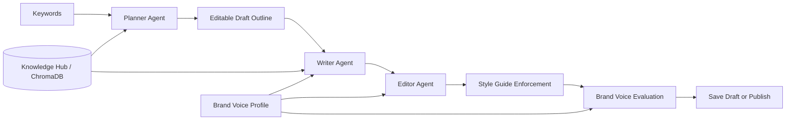
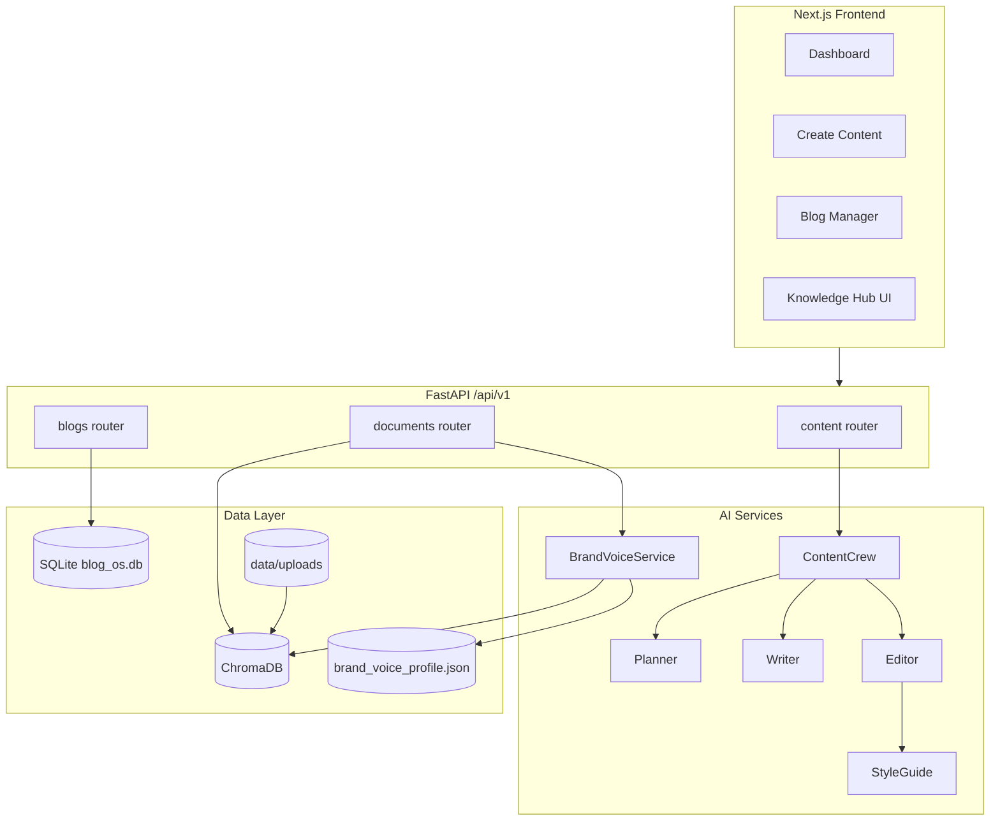
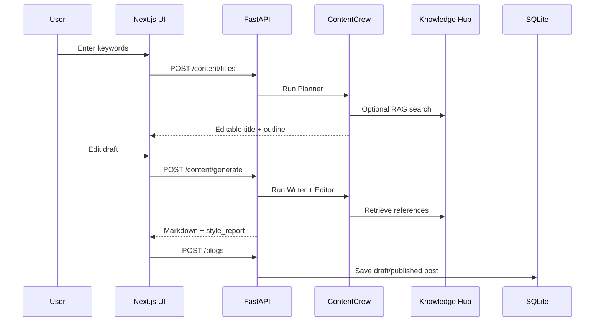
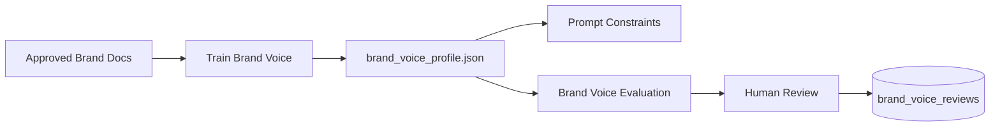
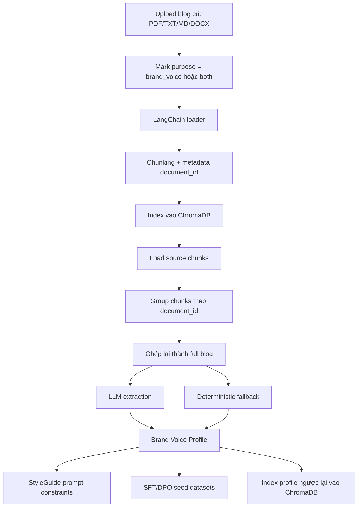
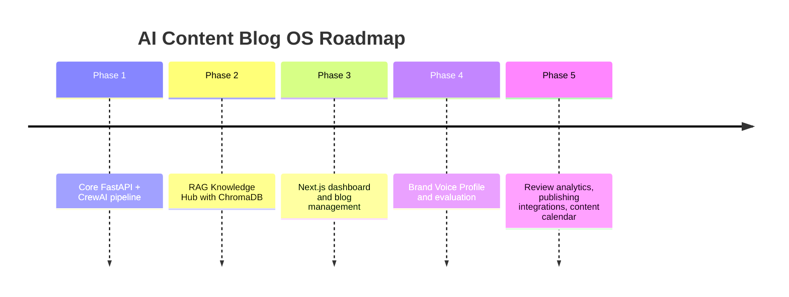

# AI Content Blog OS

<p align="center">
  
  
  
  
  
</p>

<p align="center">
  <strong>AI Content Operating System</strong> cho quy trình viết blog: Planner -> Writer -> Editor -> Brand Voice Evaluation -> Blog Management.
</p>

---

## Tổng Quan

AI Content Blog OS là một full-stack app giúp tạo, kiểm soát và quản lý bài viết bằng AI. Hệ thống kết hợp:

- Multi-agent workflow bằng CrewAI.
- RAG Knowledge Hub bằng ChromaDB.
- Corporate Style Guide và Brand Voice Profile.
- Human-in-the-loop draft review, inline rewrite, và feedback loop.
- Dashboard Next.js để tạo bài, upload tài liệu, quản lý blog.



---

## Tech Stack

| Layer | Tech |
| --- | --- |
| Frontend | Next.js 16, React 19, Tailwind CSS v4, Lucide Icons |
| Backend | FastAPI, Pydantic v2, Loguru |
| AI Orchestration | CrewAI Planner / Writer / Editor |
| LLM Providers | Google, OpenAI-compatible API, Anthropic, HuggingFace, Ollama |
| RAG | LangChain loaders, ChromaDB, sentence-transformers |
| Storage | SQLite for blogs and review records, ChromaDB for embeddings |
| Evaluation | Rule-based style checks, Brand Voice heuristics, optional LLM-as-judge |
| Tests | Pytest, pytest-asyncio, mocked RAG/vector dependencies |

---

## Kiến Trúc



---

## Project Structure

```text
.
├── backend/
│   ├── app/
│   │   ├── agents/          # Planner, Writer, Editor, LLM factory
│   │   ├── api/v1/          # FastAPI routers
│   │   ├── core/            # config, logging, style guide, interfaces
│   │   ├── crews/           # CrewAI orchestration
│   │   ├── db/              # SQLite init and dependency
│   │   ├── rag/             # loaders, embeddings, Chroma vector store
│   │   ├── repositories/    # blog and brand review persistence
│   │   ├── schemas/         # Pydantic contracts
│   │   └── services/        # content, document, brand voice logic
│   ├── config/              # corporate style guide and generated profile
│   ├── tests/
│   └── run.py
├── frontend/
│   ├── app/
│   │   ├── create/          # AI writing workflow
│   │   ├── blogs/           # blog management
│   │   ├── rag/             # document upload and brand voice training
│   │   └── components/
│   └── package.json
└── README.md
```

There is no root task runner. Run backend commands from `backend/` and frontend commands from `frontend/`.

---

## Core Workflows

### 1. Content Generation



### 2. Knowledge Hub / RAG

```text
Upload PDF/TXT/MD/DOCX
  -> validate file and purpose
  -> LangChain loader
  -> RecursiveCharacterTextSplitter
  -> embeddings
  -> ChromaDB collection: knowledge_hub
```

Document purpose:

- `knowledge`: factual references for RAG.
- `brand_voice`: approved writing samples for voice training.
- `both`: useful as both reference and voice sample.

### 3. Brand Voice v2.1

Brand Voice now supports:

- Brand identity: mission, vision, positioning, value proposition, personality traits.
- Audience personas: priorities, tone adjustment, channels, decision criteria.
- Do/don't examples.
- Channel guidance for blog, email, social, support, ads.
- Heuristic evaluation plus optional LLM-as-judge.
- Human review records stored in SQLite for a feedback loop.



### 4. Trích Xuất Đặc Trưng Từ Blog Cũ

Đây là phần biến các blog đã viết trước đây thành một Brand Voice Profile có thể dùng lại. Dữ liệu đầu vào nên là các bài đã được duyệt, thể hiện đúng giọng thương hiệu, không phải mọi tài liệu trong Knowledge Hub.



Pipeline chi tiết:

1. Upload tài liệu mẫu ở `/rag` và chọn `Brand Voice` hoặc `Both`.
2. `DocumentService` validate file, gắn `purpose`, rồi đưa sang document processor.
3. `LangChainDocumentProcessor` đọc file bằng loader tương ứng và chia chunk bằng `RecursiveCharacterTextSplitter`.
4. `ChromaVectorStore` lưu chunks vào collection `knowledge_hub`, mỗi chunk có metadata như `document_id`, `filename`, `chunk_index`, `purpose`.
5. Khi gọi `/brand-voice/train`, `BrandVoiceService` chỉ lấy documents có `purpose = brand_voice` hoặc `both`.
6. Service group chunks theo `document_id`, sort theo `chunk_index`, rồi ghép lại thành từng full blog.
7. LLM extraction agent đọc các blog mẫu và rút ra:
   - `brand_identity`: mission, vision, positioning, traits, differentiators.
   - `audience_personas`: persona, priorities, tone adjustment, decision criteria.
   - `tone`: primary tone, secondary tone, description.
   - `vocabulary`: repeated terms, preferred phrases, forbidden terms, replacements.
   - `syntax`: average sentence length, sentence style, syntax rules.
   - `presentation`: heading style, list style, article structure.
   - `do_dont_examples`, examples, rubrics.
8. Nếu LLM lỗi, hệ thống dùng fallback deterministic:
   - regex tokenization để lấy từ/cụm từ,
   - `Counter` để tìm repeated terms,
   - regex sentence split để tính average sentence length,
   - lấy representative sentences làm examples,
   - tạo starter profile với tone/rubrics mặc định.
9. Profile được ghi ra `backend/config/brand_voice_profile.json`, sinh thêm SFT/DPO seed dataset, rồi index profile Markdown trở lại ChromaDB để Writer/Editor có thể retrieve khi cần.

Nói ngắn gọn:

```text
Old approved blogs
  -> chunk/index
  -> reconstruct by document_id
  -> extract identity/tone/vocabulary/syntax/presentation
  -> build reusable Brand Voice Profile
  -> enforce/evaluate future drafts
```

---

## Quick Start

### Backend

```powershell
cd backend
python -m venv .venv
.\.venv\Scripts\python.exe -m pip install -r requirements.txt
copy .env.example .env
.\.venv\Scripts\python.exe run.py
```

Backend URL:

```text
http://127.0.0.1:8000
```

Docs:

```text
http://127.0.0.1:8000/docs
```

Important: backend settings load from `.env` in the current working directory, so run backend commands from `backend/`.

### Frontend

```powershell
cd frontend
npm install
npm run dev
```

Frontend URL:

```text
http://127.0.0.1:3000
```

Main pages:

| Route | Purpose |
| --- | --- |
| `/` | Dashboard |
| `/create` | AI writing workflow |
| `/blogs` | Blog management |
| `/rag` | Knowledge Hub and Brand Voice |

---

## Local LLM With LM Studio

Use LM Studio as an OpenAI-compatible local server.

1. Start LM Studio.
2. Load a chat/instruct model.
3. Start the local server at:

```text
http://127.0.0.1:1234/v1
```

Use this in `backend/.env`:

```env
RUN_MODE=cloud
AI_PROVIDER=openai

OPENAI_API_KEY=dummy_key_for_local_server
OPENAI_API_BASE=http://127.0.0.1:1234/v1

PLANNER_MODEL=qwen3-1.7b
WRITER_MODEL=qwen3-1.7b
EDITOR_MODEL=qwen3-1.7b

DEBUG=false
```

Notes:

- `RUN_MODE=cloud` is intentional because LM Studio is called through an OpenAI-compatible HTTP API.
- `OPENAI_API_KEY` can be any non-empty value for local servers.
- `DEBUG` must be `true` or `false`, not `release`.

---

## API Map

### Content

| Method | Endpoint | Description |
| --- | --- | --- |
| `POST` | `/api/v1/content/titles` | Planner creates one editable draft outline |
| `POST` | `/api/v1/content/generate` | Writer + Editor generate the full article |
| `POST` | `/api/v1/content/rewrite` | Rewrite selected text with user feedback |

### Blogs

| Method | Endpoint | Description |
| --- | --- | --- |
| `GET` | `/api/v1/blogs` | List posts |
| `POST` | `/api/v1/blogs` | Save draft or published post |
| `GET` | `/api/v1/blogs/{id}` | Read one post |
| `PUT` | `/api/v1/blogs/{id}` | Update post |
| `DELETE` | `/api/v1/blogs/{id}` | Delete post |

### Documents and Brand Voice

| Method | Endpoint | Description |
| --- | --- | --- |
| `POST` | `/api/v1/documents/upload` | Upload and index a document |
| `GET` | `/api/v1/documents` | List indexed documents |
| `DELETE` | `/api/v1/documents/{id}` | Delete a document from ChromaDB |
| `POST` | `/api/v1/documents/search` | Semantic search in Knowledge Hub |
| `POST` | `/api/v1/documents/brand-voice/train` | Build active Brand Voice Profile |
| `GET` | `/api/v1/documents/brand-voice/profile` | Get active profile |
| `POST` | `/api/v1/documents/brand-voice/evaluate` | Score content against the profile |
| `POST` | `/api/v1/documents/brand-voice/reviews` | Store automated eval + human review |
| `GET` | `/api/v1/documents/brand-voice/reviews` | List review history |

---

## Brand Voice Examples

### Train

```powershell
curl -X POST http://127.0.0.1:8000/api/v1/documents/brand-voice/train `
  -H "Content-Type: application/json" `
  -d '{
    "company_name": "Acme",
    "document_ids": [],
    "min_documents": 20,
    "max_documents": 30,
    "brand_identity": {
      "mission": "Make AI content practical for business teams.",
      "positioning": "Practical AI content advisor.",
      "personality_traits": ["clear", "credible", "direct"]
    },
    "audience_personas": [
      {
        "name": "Marketing lead",
        "priorities": ["clarity", "pipeline impact"],
        "tone_adjustment": "Strategic and direct."
      }
    ],
    "channels": ["blog", "email", "social", "support", "ads"]
  }'
```

### Evaluate With Optional LLM Judge

```powershell
curl -X POST http://127.0.0.1:8000/api/v1/documents/brand-voice/evaluate `
  -H "Content-Type: application/json" `
  -d '{
    "channel": "blog",
    "content_type": "blog_post",
    "persona_name": "Marketing lead",
    "use_llm_judge": true,
    "content": "# Example Title\n\n## Section\n\nYour generated draft here..."
  }'
```

### Store Human Review

```powershell
curl -X POST http://127.0.0.1:8000/api/v1/documents/brand-voice/reviews `
  -H "Content-Type: application/json" `
  -d '{
    "channel": "blog",
    "content_type": "blog_post",
    "human_score": 92,
    "human_notes": "On brand, but intro can be sharper.",
    "approved": true,
    "reviewer": "Content Lead",
    "content": "# Example Title\n\n## Section\n\nReviewed draft..."
  }'
```

---

## Generated Files

Runtime data is created under `backend/data/` by default.

```text
backend/data/blog_os.db                 # SQLite blogs and brand reviews
backend/data/chroma/                    # ChromaDB persistent vector store
backend/data/uploads/                   # uploaded documents
backend/data/brand_voice/               # generated SFT/DPO seed datasets
backend/config/brand_voice_profile.json # active Brand Voice Profile
```

Do not commit generated/vendor directories:

- `backend/.venv/`
- `backend/.pytest_cache/`
- `backend/data/`
- `frontend/node_modules/`
- `frontend/.next/`

---

## Testing

Backend focused tests:

```powershell
cd backend
$env:DEBUG='false'
.\.venv\Scripts\python.exe -m pytest tests\test_brand_voice_service.py -v
.\.venv\Scripts\python.exe -m pytest tests
```

Frontend:

```powershell
cd frontend
npm run lint
npm run build
```

If PowerShell blocks `npm.ps1`, use:

```powershell
npm.cmd run lint
npm.cmd run build
```

Note: run pytest against `backend/tests`. The backend root contains a manual `test_lmstudio.py` script that tries to connect to LM Studio during collection.

---

## Roadmap



---

## One-Liner

```text
AI Content Blog OS = your RAG-backed writing team, brand voice guardrail, and blog CMS in one local-first workspace.
```
