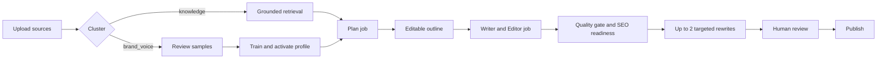

<h1 align="center">AI Content OS</h1>
<p align="center"><strong>Project-scoped, review-gated AI writing for internal content teams.</strong></p>

AI Content OS combines FastAPI, a background worker, SQLite, ChromaDB, CrewAI, a GPU-backed vLLM inference service, and a Next.js operations UI. It turns approved source material into reviewable blog drafts while keeping project data isolated and requiring human approval before publication.

> **Release status:** ready for an internal pilot. The fixed 25-topic quality benchmark is still outstanding, so this is not yet an unqualified public release.

## Why It Exists

The system keeps facts and writing style separate:

| Cluster | Content | Generation use |
| --- | --- | --- |
| `knowledge` | Product facts, references, and source documents | Grounds factual claims and produces citations |
| `brand_voice` | Candidate writing samples | Trains profiles only after reviewer approval with rating 4 or 5 |
| `evaluation` | Held-out evaluation material | Never used for generation |

Profiles are immutable and versioned per project. Every generation run records the exact profile version, citations, attempts, quality report, reviewer decision, and final publication state.

## Workflow


```mermaid
flowchart LR
    A[Upload sources] --> B{Cluster}
    B -->|knowledge| C[Grounded retrieval]
    B -->|brand_voice| D[Review samples]
    D --> E[Train and activate profile]
    C --> F[Plan job]
    E --> F
    F --> G[Editable outline]
    G --> H[Writer and Editor job]
    H --> I[Quality gate and SEO readiness]
    I --> L[Up to 2 targeted rewrites]
    L --> J[Human review]
    J --> K[Publish]
```

Planning, generation, and profile training are asynchronous. The API persists jobs in SQLite; `backend/worker.py` processes them and supports retry and crash recovery.

Every terminal draft includes Brand, Style, Fingerprint, Persona, and Content SEO Readiness V2 details. SEO V2 checks intent satisfaction, helpful completeness, information gain, evidence and trust, title/snippet accuracy, semantic topic coverage, and scannability. It is informational by default, excluded from the overall score, and does not claim to predict search ranking. Optional web research records the query, title, URL, snippet, and domain used by the writing pipeline.

Run the deterministic 25-case SEO smoke benchmark from `backend/` with `.\.venv\Scripts\python.exe scripts\run_seo_benchmark.py`. Human-score correlation remains pending until two reviewers score the fixture independently.

See [Content SEO Readiness V2](docs/plans/2026-08-23-content-seo-v2.md) for metric definitions, research sources, LM Studio judge configuration, calibration requirements, and the separate post-publish technical SEO phase.

## Product Surface

| Route | Purpose |
| --- | --- |
| `/` | Operational dashboard |
| `/create` | Brief, planning, outline editing, generation, and quality results |
| `/review` | Content editing, scoring, approval, rejection, and publishing |
| `/rag` | Projects, source clusters, sample approval, and profile versions |
| `/blogs` | Project-scoped drafts and published posts |

Business APIs are under `/api/v1`. `GET /health` and `GET /ready` are root system endpoints.

## Quick Start

### GPU Server Deployment

Requirements:

- Linux server with an NVIDIA GPU and at least 8 GB VRAM for the default 2B model
- Current NVIDIA driver, Docker Engine, Docker Compose v2, and NVIDIA Container Toolkit
- A Cloudflare-managed domain and remotely-managed Tunnel for public access

Prepare configuration from the repository root:

```bash
cp deploy.env.example .env
cp backend/.env.example backend/.env
```

Edit root `.env`:

- Replace `VLLM_API_KEY` with a long random internal token.
- Set `NEXT_PUBLIC_API_BASE_URL=https://api.example.com/api/v1`.
- Set `ALLOWED_ORIGINS=["https://app.example.com"]`.
- Paste the remotely-managed tunnel token into `CLOUDFLARE_TUNNEL_TOKEN`.
- Override `VLLM_MODEL`, `VLLM_MAX_MODEL_LEN`, or `VLLM_GPU_MEMORY_UTILIZATION` when required by the GPU.

Edit `backend/.env`:

- Replace every placeholder in `INTERNAL_ACCESS_TOKENS`.
- Keep `AUTH_ENABLED=true` and `ALLOW_INSECURE_AUTH=false`.
- Set `ALLOWED_ORIGINS` to the public frontend origins.

In the [Cloudflare Tunnel dashboard](https://developers.cloudflare.com/tunnel/setup/), add two published application routes to the same tunnel:

| Public hostname | Service URL |
| --- | --- |
| `app.example.com` | `http://frontend:3000` |
| `api.example.com` | `http://api:8000` |

The service names above resolve inside the Compose network. Do not add a public route for `vllm`.

Start the complete stack with the Cloudflare profile:

```bash
docker compose --profile cloudflare up -d --build
docker compose ps
docker compose logs -f vllm
docker compose logs -f cloudflared
```

Cloudflare Tunnel creates outbound connections, so ports `3000` and `8000` remain bound to `127.0.0.1` on the host. The first startup downloads approximately 4.6 GB of Qwen model weights, compiles vLLM kernels, and indexes the bundled writing samples. Model and compile caches are persisted in named Docker volumes. Verify the deployment after the services become healthy:

```bash
curl http://127.0.0.1:8000/ready
curl http://127.0.0.1:3000
curl https://api.example.com/health
```

Open `https://app.example.com`, configure one of the writer tokens from `backend/.env`, and create a blog. A clean database is automatically initialized with the `The Sun Symphony Demo` project, ten approved writing samples, and an active `TSS Demo` brand profile. Seeding is idempotent and does not replace an existing active profile. Set `DEMO_SEED_ENABLED=false` for a blank installation.

External API clients use `https://api.example.com/api/v1` with `Authorization: Bearer <token>`. Interactive OpenAPI documentation is available at `https://api.example.com/docs`.

The default inference configuration is:

```env
RUN_MODE=local
AI_PROVIDER=vllm
VLLM_MODEL=Qwen/Qwen3.5-2B
VLLM_MODEL_NAME=qwen3.5-2b
```

Planner, Writer, Editor, profile extraction, and the final evaluator share the same vLLM process. Thinking is disabled server-side and Qwen tool calling is enabled for CrewAI.

### Manual Application Development

Run vLLM separately at `http://127.0.0.1:8001/v1`, then install and start the application:

```powershell
cd backend
python -m venv .venv
.\.venv\Scripts\python.exe -m pip install -r requirements.txt
Copy-Item .env.example .env
.\.venv\Scripts\python.exe run.py
```

In a second terminal:

```powershell
cd backend
.\.venv\Scripts\python.exe worker.py
```

In a third terminal:

```powershell
cd frontend
npm install
npm run dev
```

Open `http://127.0.0.1:3000` and check `http://127.0.0.1:8000/ready`.

## Architecture

```mermaid
flowchart TB
    USERS[Browser and API clients] --> CF[Cloudflare Tunnel]
    CF --> UI[Next.js UI]
    CF --> API[FastAPI]
    API --> AUTH[Role and project authorization]
    API --> DB[(SQLite jobs and metadata)]
    API --> VECTOR[(Chroma vectors)]
    WORKER[Background worker] --> DB
    WORKER --> VECTOR
    WORKER --> LLM[vLLM / Qwen3.5-2B]
    LLM --> GPU[NVIDIA GPU]
    READY[/ready] --> DB
    READY --> VECTOR
    READY --> LLM
```

```text
backend/app/api/v1/       HTTP routers
backend/app/repositories/ SQLite persistence and state transitions
backend/app/workers/      Planning, generation, and profile jobs
backend/seed/tss/         Bundled writing samples and initial active profile
backend/app/rag/          Loading, embeddings, retrieval, and Chroma
backend/worker.py         Persistent job consumer
frontend/app/             Next.js routes and shared workspace UI
scripts/                  Local production start and stop scripts
```

## Supported API Flow

The UI implements the complete workflow. For integrations, use the OpenAPI docs at `http://127.0.0.1:8000/docs`.

| Method | Route | Minimum role |
| --- | --- | --- |
| `POST` | `/projects` | admin |
| `POST` | `/documents/upload` | writer |
| `POST` | `/projects/{project}/documents/{document}/approval` | reviewer |
| `GET` | `/projects/{project}/profiles` | writer |
| `POST` | `/projects/{project}/profiles/train` | admin |
| `POST` | `/projects/{project}/profiles/{profile}/activate` | admin |
| `POST` | `/projects/{project}/generation-runs` | writer |
| `PATCH` | `/generation-runs/{run}/outline` | writer |
| `POST` | `/generation-runs/{run}/generate` | writer |
| `GET` | `/jobs/{job}` | writer |
| `POST` | `/generation-runs/{run}/review` | reviewer |
| `POST` | `/generation-runs/{run}/publish` | reviewer |

Use this polling helper for queued operations:

```powershell
function Wait-ContentJob($api, $jobId, $headers) {
  do {
    Start-Sleep -Seconds 1
    $job = Invoke-RestMethod -Uri "$api/jobs/$jobId" -Headers $headers
  } while ($job.status -in @('queued', 'running'))
  if ($job.status -ne 'succeeded') { throw ($job.error | ConvertTo-Json -Compress) }
  return $job
}
```

Profile training requires at least five `brand_voice` uploads approved by a reviewer with `human_rating` 4 or 5. Capture each upload response's `document_id`, approve those exact IDs, queue training, and wait for the returned `job.job_id` before listing and activating the new profile.

Generation follows the same pattern: create a run, wait for its planning job, edit the returned outline, queue generation, wait for the generation job, then send the run to a reviewer. Publishing is rejected until the run is approved.

### Legacy APIs

- Synchronous `/content/*` routes are disabled by default with `ENABLE_LEGACY_SYNC_API=false` and return `404`.
- Synchronous `/documents/brand-voice/*` routes are retired and return `410 Gone`.

New integrations must use project-scoped jobs and generation runs.

## Verified Evidence

| Check | Result |
| --- | --- |
| Backend suite | 85 tests passed, 1 model-backed eval skipped by default |
| Frontend | ESLint and production build passed |
| vLLM deployment | Provider, authenticated readiness, and Compose structure tested; GPU smoke test runs on the deployment server |
| TSS smoke | Brand 87, style 92, fingerprint 45, persona 55 |
| Rewrite loop | 2 targeted rewrites |
| Publication | Human approval required |

The smoke run proves the operational path, not broad writing quality. The fingerprint score of 45 remained below threshold and required reviewer judgment. Run and document the fixed 25-topic benchmark before claiming a public quality release.

Offline DeepEval and Ragas benchmarks are documented in [backend/EVALUATION.md](backend/EVALUATION.md). They are internal evaluation tools and are not part of the customer-facing runtime score.

## Operations

### Tests

```powershell
cd backend
.\.venv\Scripts\python.exe -m pytest

cd ..\frontend
npm.cmd run lint
npm.cmd run build
```

### Backup

```powershell
.\backend\.venv\Scripts\python.exe .\backend\scripts\backup_runtime.py backup `
  --data-dir .\backend\data `
  --config-dir .\backend\config `
  --backup-dir .\backups\contentos-YYYYMMDD
```

Restore during a maintenance window with the same script's `restore` action. `--force` replaces existing runtime destinations.

### Docker

On the Linux/NVIDIA deployment host:

```bash
docker compose --profile cloudflare up -d --build
docker compose ps
docker compose down
```

`docker-compose.yml` starts vLLM, API, worker, and frontend. The `cloudflare` profile adds the tunnel connector. It forces secure auth settings for the API and worker; configure real tokens in `backend/.env` and root `.env` before startup.

## Security And Release Checklist

- [ ] Authentication enabled with unique, project-scoped tokens
- [ ] Cloudflare routes expose only `frontend:3000` and `api:8000`, never `vllm`
- [ ] `ALLOWED_ORIGINS` contains the exact public frontend origin
- [ ] Root `.env` contains a real tunnel token and remains untracked
- [ ] Legacy synchronous APIs disabled
- [ ] Knowledge and brand samples stored in the correct clusters
- [ ] Brand samples explicitly approved and rated before training
- [ ] Intended immutable profile activated for each project
- [ ] `/ready` verifies SQLite, Chroma, and the expected model
- [ ] Backend tests, frontend lint, and production build pass
- [ ] Runtime backup created and verified
- [ ] Human review enforced before publishing
- [ ] Fixed 25-topic benchmark passed and recorded before public release

## Further Reading

- [Internal ship-ready plan](docs/superpowers/plans/2026-07-17-internal-ship-ready.md)
- [README redesign specification](docs/superpowers/specs/2026-07-18-readme-redesign-design.md)
