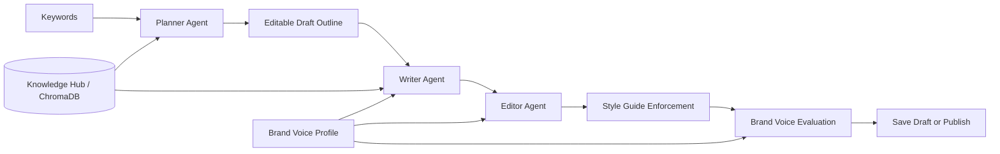
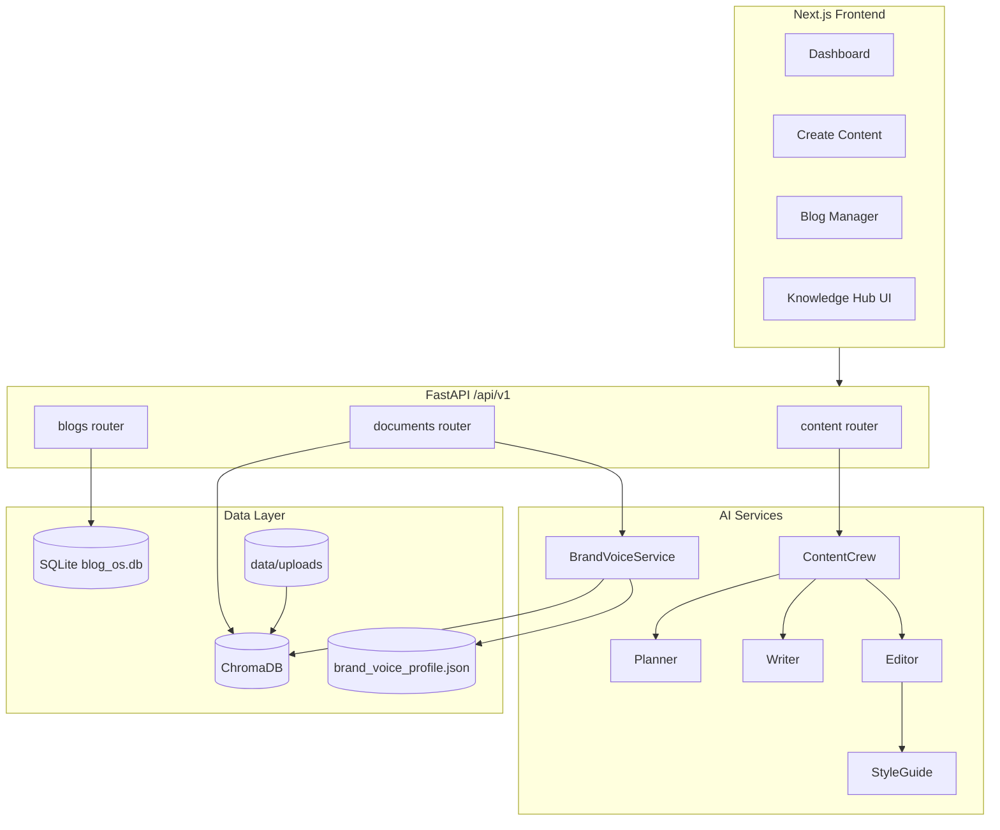
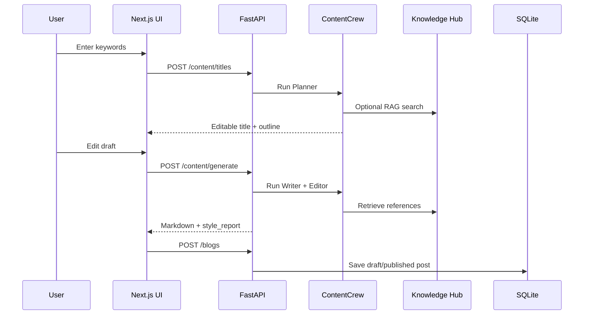
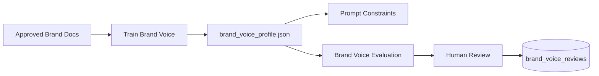
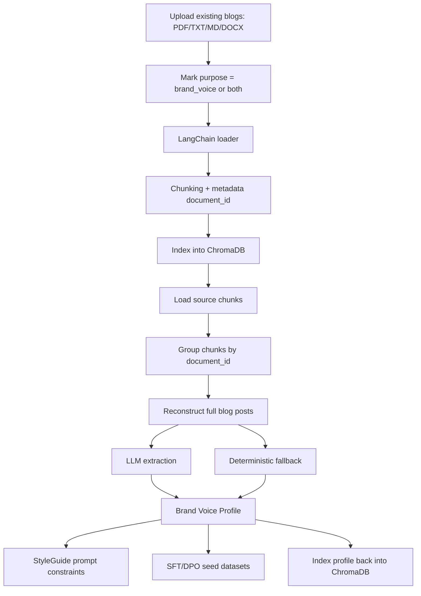
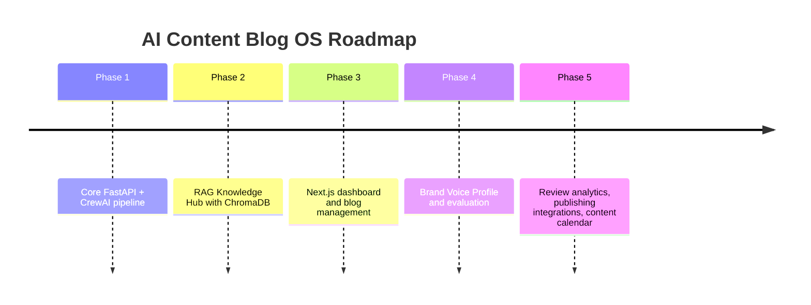

# AI Content Blog OS

<p align="center">
  
  
  
  
  
</p>

<p align="center">
  <strong>AI Content Operating System</strong> cho quy trình viết blog: Planner -> Writer -> Editor -> Brand Voice Evaluation -> Blog Management.
</p>

---

## Tổng Quan

AI Content Blog OS là một full-stack app giúp tạo, kiểm soát và quản lý bài viết bằng AI. Hệ thống kết hợp:

- Multi-agent workflow bằng CrewAI.
- RAG Knowledge Hub bằng ChromaDB.
- Corporate Style Guide và Brand Voice Profile.
- Human-in-the-loop draft review, inline rewrite, và feedback loop.
- Dashboard Next.js để tạo bài, upload tài liệu, quản lý blog.


```mermaid
flowchart LR
    A[Keywords] --> B[Planner Agent]
    B --> C[Editable Draft Outline]
    C --> D[Writer Agent]
    D --> E[Editor Agent]
    E --> F[Style Guide Enforcement]
    F --> G[Brand Voice Evaluation]
    G --> H[Save Draft or Publish]

    R[(Knowledge Hub / ChromaDB)] --> B
    R --> D
    V[Brand Voice Profile] --> D
    V --> E
    V --> G
```

---

## Tech Stack

| Layer | Tech |
| --- | --- |
| Frontend | Next.js 16, React 19, Tailwind CSS v4, Lucide Icons |
| Backend | FastAPI, Pydantic v2, Loguru |
| AI Orchestration | CrewAI Planner / Writer / Editor |
| LLM Providers | Google, OpenAI-compatible API, Anthropic, HuggingFace, Ollama |
| RAG | LangChain loaders, ChromaDB, sentence-transformers |
| Storage | SQLite for blogs and review records, ChromaDB for embeddings |
| Evaluation | Rule-based style checks, Writing Fingerprint fit, Brand Voice heuristics, optional LLM-as-judge |
| Tests | Pytest, pytest-asyncio, mocked RAG/vector dependencies |

---

## Kiến Trúc


```mermaid
flowchart TB
    subgraph Frontend[Next.js Frontend]
        Dashboard[Dashboard]
        Create[Create Content]
        Blogs[Blog Manager]
        RAGUI[Knowledge Hub UI]
    end

    subgraph API[FastAPI /api/v1]
        ContentAPI[content router]
        DocsAPI[documents router]
        BlogAPI[blogs router]
    end

    subgraph AI[AI Services]
        Crew[ContentCrew]
        Planner[Planner]
        Writer[Writer]
        Editor[Editor]
        Style[StyleGuide]
        Voice[BrandVoiceService]
    end

    subgraph Data[Data Layer]
        SQLite[(SQLite blog_os.db)]
        Chroma[(ChromaDB)]
        Uploads[(data/uploads)]
        Profile[(brand_voice_profile.json)]
    end

    Frontend --> API
    ContentAPI --> Crew
    Crew --> Planner
    Crew --> Writer
    Crew --> Editor
    Editor --> Style
    DocsAPI --> Voice
    DocsAPI --> Chroma
    BlogAPI --> SQLite
    Voice --> Profile
    Voice --> Chroma
    Uploads --> Chroma
```

---

## Project Structure

```text
.
├── backend/
│   ├── app/
│   │   ├── agents/          # Planner, Writer, Editor, LLM factory
│   │   ├── api/v1/          # FastAPI routers
│   │   ├── core/            # config, logging, style guide, interfaces
│   │   ├── crews/           # CrewAI orchestration
│   │   ├── db/              # SQLite init and dependency
│   │   ├── rag/             # loaders, embeddings, Chroma vector store
│   │   ├── repositories/    # blog and brand review persistence
│   │   ├── schemas/         # Pydantic contracts
│   │   └── services/        # content, document, brand voice logic
│   ├── config/              # corporate style guide and generated profile
│   ├── tests/
│   └── run.py
├── frontend/
│   ├── app/
│   │   ├── create/          # AI writing workflow
│   │   ├── blogs/           # blog management
│   │   ├── rag/             # document upload and brand voice training
│   │   └── components/
│   └── package.json
└── README.md
```

There is no root task runner. Run backend commands from `backend/` and frontend commands from `frontend/`.

---

## Core Workflows

### 1. Content Generation


```mermaid
sequenceDiagram
    participant U as User
    participant FE as Next.js UI
    participant API as FastAPI
    participant C as ContentCrew
    participant R as Knowledge Hub
    participant DB as SQLite

    U->>FE: Enter keywords
    FE->>API: POST /content/titles
    API->>C: Run Planner
    C->>R: Optional RAG search
    C-->>FE: Editable title + outline
    U->>FE: Edit draft
    FE->>API: POST /content/generate
    API->>C: Run Writer + Editor
    C->>R: Retrieve references
    API-->>FE: Markdown + style_report
    FE->>API: POST /blogs
    API->>DB: Save draft/published post
```

Before Writer and Editor run, `ContentService` loads `corporate_style_guide.json` and the active `brand_voice_profile.json`. The prompt includes brand identity, audience personas, writing fingerprint metrics, preferred vocabulary, forbidden terms, do/don't examples, and reviewer rubrics. After generation, deterministic style checks run again before the response is returned.

### 2. Knowledge Hub / RAG

```text
Upload PDF/TXT/MD/DOCX
  -> validate file and purpose
  -> LangChain loader
  -> RecursiveCharacterTextSplitter
  -> embeddings
  -> ChromaDB collection: knowledge_hub
```

Document purpose:

- `knowledge`: factual references for RAG.
- `brand_voice`: approved writing samples for voice training.
- `both`: useful as both reference and voice sample.

### 3. Brand Voice v2.2

Brand Voice now supports:

- Brand identity: mission, vision, positioning, value proposition, personality traits.
- Audience personas: priorities, tone adjustment, channels, decision criteria.
- Writing Fingerprint: sentence rhythm, punctuation habits, transition phrases, pronoun style, argument stance.
- Do/don't examples.
- Channel guidance for blog, email, social, support, ads.
- Heuristic evaluation for voice, identity, persona, structure, and writing fingerprint fit.
- Optional LLM-as-judge for deeper review.
- Human review records stored in SQLite for a feedback loop.


```mermaid
flowchart LR
    A[Approved Brand Docs] --> B[Train Brand Voice]
    B --> C[brand_voice_profile.json]
    C --> D[Prompt Constraints]
    C --> E[Brand Voice Evaluation]
    E --> F[Human Review]
    F --> G[(brand_voice_reviews)]
```

### 4. Feature Extraction From Existing Blogs

This is the data-processing step that turns previously approved blog posts into a reusable Brand Voice Profile. The input should be curated, on-brand writing samples, not every document in the Knowledge Hub.


```mermaid
flowchart TB
    A[Upload existing blogs: PDF/TXT/MD/DOCX] --> B[Mark purpose = brand_voice or both]
    B --> C[LangChain loader]
    C --> D[Chunking + metadata document_id]
    D --> E[Index into ChromaDB]
    E --> F[Load source chunks]
    F --> G[Group chunks by document_id]
    G --> H[Reconstruct full blog posts]
    H --> I[LLM extraction]
    H --> J[Deterministic fallback]
    I --> K[Brand Voice Profile]
    J --> K
    K --> L[StyleGuide prompt constraints]
    K --> M[SFT/DPO seed datasets]
    K --> N[Index profile back into ChromaDB]
```

Detailed pipeline:

1. Upload source samples from `/rag` and choose `Brand Voice` or `Both`.
2. `DocumentService` validates the file, attaches the selected `purpose`, and passes it to the document processor.
3. `LangChainDocumentProcessor` loads the file with the matching loader and splits it with `RecursiveCharacterTextSplitter`.
4. `ChromaVectorStore` stores chunks in the `knowledge_hub` collection. Each chunk keeps metadata such as `document_id`, `filename`, `chunk_index`, and `purpose`.
5. When `/brand-voice/train` runs, `BrandVoiceService` only selects documents with `purpose = brand_voice` or `both`.
6. The service groups chunks by `document_id`, sorts them by `chunk_index`, and reconstructs each full blog post.
7. The LLM extraction agent analyzes the reconstructed blog posts and extracts:
   - `brand_identity`: mission, vision, positioning, traits, differentiators.
   - `audience_personas`: persona, priorities, tone adjustment, decision criteria.
   - `writing_fingerprint`: sentence patterns, vocabulary fingerprints, perspective matching.
   - `tone`: primary tone, secondary tone, description.
   - `vocabulary`: repeated terms, preferred phrases, forbidden terms, replacements.
   - `syntax`: average sentence length, sentence style, syntax rules.
   - `presentation`: heading style, list style, article structure.
   - `do_dont_examples`, examples, rubrics.
8. The backend also computes deterministic writing-fingerprint metrics so the profile does not depend only on the LLM:
   - average sentence length,
   - short-fragment ratio,
   - rhetorical-question ratio,
   - dash usage per 1,000 words,
   - parenthetical-aside ratio,
   - active-voice ratio,
   - punctuation profile,
   - transition phrases,
   - self-reference and reader-address style,
   - stance such as mentor, peer, or contrarian.
9. If the LLM extraction fails, the system uses a deterministic fallback:
   - regex tokenization to extract words and terms,
   - `Counter` to identify repeated terms,
   - regex sentence splitting to estimate average sentence length,
   - representative sentences as examples,
   - a starter tone/rubric profile.
10. The generated profile is written to `backend/config/brand_voice_profile.json`, SFT/DPO seed datasets are exported, and the profile Markdown is indexed back into ChromaDB so Writer/Editor agents can retrieve it later.

In short:

```text
Old approved blogs
  -> chunk/index
  -> reconstruct by document_id
  -> extract identity/fingerprint/tone/vocabulary/syntax/presentation
  -> build reusable Brand Voice Profile
  -> enforce/evaluate future drafts
```

Writing Fingerprint metrics:

| Metric | What It Captures | Why It Matters |
| --- | --- | --- |
| `average_sentence_words` | Average sentence length | Keeps the draft close to the source rhythm |
| `short_fragment_ratio` | Ratio of 2-4 word fragments | Preserves punchy emphasis such as "Not really." |
| `rhetorical_question_ratio` | How often sentences end with `?` | Detects question-led argument style |
| `dash_usage_per_1000_words` | Em dash/en dash/spaced hyphen usage | Captures aside-heavy or contrast-heavy writing |
| `parenthetical_aside_ratio` | Parenthetical insertions | Captures personal notes and side thoughts |
| `active_voice_ratio` | Approximate active/passive balance | Keeps the writing direct |
| `punctuation_per_1000_words` | Commas, colons, semicolons, dashes, parentheses | Captures punctuation fingerprint |
| `transition_phrases` | Repeated connectors such as "thuc ra thi", "khong han" | Preserves natural connective tissue |
| `self_reference` | "toi", "minh", "chung toi", "we" | Matches narrator identity |
| `reader_address` | "ban", "anh em", "developer", "team" | Matches how the writer speaks to readers |
| `stance` | mentor, peer, or contrarian | Captures the writer's argumentative posture |

---

## Internal Release Workflow

The production path is project-scoped and asynchronous:

```text
Knowledge documents --------------------> grounded retrieval + citations
Approved 4-5 star brand samples --------> versioned Brand Voice Profile
Brief -> plan job -> editable outline -> generate job -> quality gate
      -> human review -> approval -> publish
```

Key operational rules:

- Run both the API and `backend/worker.py`; generation and profile training are queued jobs.
- Activate one immutable profile version per project. Generation runs retain the exact `profile_id` used.
- Keep factual sources in the `knowledge` cluster and writing samples in `brand_voice`.
- Only explicitly approved, high-rated writing samples are eligible for profile training.
- Publishing is blocked until a reviewer approves the generation run.
- `/health` reports process liveness; `/ready` checks SQLite, vector storage, and the expected LM Studio model.
- Set `AUTH_ENABLED=true` and configure `INTERNAL_ACCESS_TOKENS` outside local development.

Build once and start the complete local production stack from the repository root:

```powershell
cd frontend
npm.cmd run build
cd ..
.\scripts\start_internal.ps1
```

For an explicitly insecure local-only session with `AUTH_ENABLED=false`, use `.\scripts\start_internal.ps1 -AllowInsecureLocal`.

Open `http://127.0.0.1:3000`. Stop it with:

```powershell
.\scripts\stop_internal.ps1
```

Create a runtime backup from `backend/`:

```powershell
.\.venv\Scripts\python.exe scripts\backup_runtime.py backup `
  --backup-dir ..\backups\contentos-YYYYMMDD
```

Before releasing a model/profile combination, run the fixed evaluation set and require at least 80% overall pass rate, 100% citation coverage for factual claims, no critical style violations, and a documented human review sample.

---

## Quick Start

### Backend

```powershell
cd backend
python -m venv .venv
.\.venv\Scripts\python.exe -m pip install -r requirements.txt
copy .env.example .env
.\.venv\Scripts\python.exe run.py
```

Backend URL:

```text
http://127.0.0.1:8000
```

Docs:

```text
http://127.0.0.1:8000/docs
```

Important: backend settings load from `.env` in the current working directory, so run backend commands from `backend/`.

### Frontend

```powershell
cd frontend
npm install
npm run dev
```

Frontend URL:

```text
http://127.0.0.1:3000
```

Main pages:

| Route | Purpose |
| --- | --- |
| `/` | Dashboard |
| `/create` | AI writing workflow |
| `/blogs` | Blog management |
| `/rag` | Knowledge Hub and Brand Voice |

---

## Local LLM With LM Studio

Use LM Studio as an OpenAI-compatible local server.

1. Start LM Studio.
2. Load a chat/instruct model.
3. Start the local server at:

```text
http://127.0.0.1:1234/v1
```

Use this in `backend/.env`:

```env
RUN_MODE=cloud
AI_PROVIDER=openai

OPENAI_API_KEY=dummy_key_for_local_server
OPENAI_API_BASE=http://127.0.0.1:1234/v1

PLANNER_MODEL=qwen3.5-2b
WRITER_MODEL=qwen3.5-2b
EDITOR_MODEL=qwen3.5-2b

DEBUG=false
```

Notes:

- `RUN_MODE=cloud` is intentional because LM Studio is called through an OpenAI-compatible HTTP API.
- `OPENAI_API_KEY` can be any non-empty value for local servers.
- `DEBUG` must be `true` or `false`, not `release`.

---

## API Map

### Content

| Method | Endpoint | Description |
| --- | --- | --- |
| `POST` | `/api/v1/content/titles` | Planner creates one editable draft outline |
| `POST` | `/api/v1/content/generate` | Writer + Editor generate the full article |
| `POST` | `/api/v1/content/rewrite` | Rewrite selected text with user feedback |

### Blogs

| Method | Endpoint | Description |
| --- | --- | --- |
| `GET` | `/api/v1/blogs` | List posts |
| `POST` | `/api/v1/blogs` | Save draft or published post |
| `GET` | `/api/v1/blogs/{id}` | Read one post |
| `PUT` | `/api/v1/blogs/{id}` | Update post |
| `DELETE` | `/api/v1/blogs/{id}` | Delete post |

### Documents and Brand Voice

| Method | Endpoint | Description |
| --- | --- | --- |
| `POST` | `/api/v1/documents/upload` | Upload and index a document |
| `GET` | `/api/v1/documents` | List indexed documents |
| `DELETE` | `/api/v1/documents/{id}` | Delete a document from ChromaDB |
| `POST` | `/api/v1/documents/search` | Semantic search in Knowledge Hub |
| `POST` | `/api/v1/documents/brand-voice/train` | Build active Brand Voice Profile |
| `GET` | `/api/v1/documents/brand-voice/profile` | Get active profile |
| `POST` | `/api/v1/documents/brand-voice/evaluate` | Score content against the profile |
| `POST` | `/api/v1/documents/brand-voice/reviews` | Store automated eval + human review |
| `GET` | `/api/v1/documents/brand-voice/reviews` | List review history |

---

## Brand Voice Examples

### Train

```powershell
curl -X POST http://127.0.0.1:8000/api/v1/documents/brand-voice/train `
  -H "Content-Type: application/json" `
  -d '{
    "company_name": "Acme",
    "document_ids": [],
    "min_documents": 20,
    "max_documents": 30,
    "brand_identity": {
      "mission": "Make AI content practical for business teams.",
      "positioning": "Practical AI content advisor.",
      "personality_traits": ["clear", "credible", "direct"]
    },
    "audience_personas": [
      {
        "name": "Marketing lead",
        "priorities": ["clarity", "pipeline impact"],
        "tone_adjustment": "Strategic and direct."
      }
    ],
    "channels": ["blog", "email", "social", "support", "ads"]
  }'
```

The generated `brand_voice_profile.json` includes a machine-readable writing fingerprint:

```json
{
  "brand_identity": {
    "mission": "Make AI content practical for business teams.",
    "positioning": "Practical AI content advisor.",
    "personality_traits": ["clear", "credible", "direct"]
  },
  "audience_personas": [
    {
      "name": "Marketing lead",
      "priorities": ["clarity", "pipeline impact"],
      "tone_adjustment": "Strategic and direct."
    }
  ],
  "writing_fingerprint": {
    "sentence_patterns": {
      "average_sentence_words": 14.6,
      "short_fragment_ratio": 0.12,
      "rhetorical_question_ratio": 0.05,
      "dash_usage_per_1000_words": 2.8,
      "parenthetical_aside_ratio": 0.03,
      "active_voice_ratio": 0.91
    },
    "vocabulary_fingerprints": {
      "preferred_terms": ["core", "practical", "workflow"],
      "transition_phrases": ["thuc ra thi", "khong han"],
      "forbidden_cliches": ["trong kỷ nguyên số", "đột phá", "toàn diện"]
    },
    "perspective_matching": {
      "self_reference": "tôi",
      "reader_address": "bạn",
      "stance": "mentor",
      "argument_style": "explain_then_recommend"
    }
  }
}
```

### Evaluate With Optional LLM Judge

```powershell
curl -X POST http://127.0.0.1:8000/api/v1/documents/brand-voice/evaluate `
  -H "Content-Type: application/json" `
  -d '{
    "channel": "blog",
    "content_type": "blog_post",
    "persona_name": "Marketing lead",
    "use_llm_judge": true,
    "content": "# Example Title\n\n## Section\n\nYour generated draft here..."
  }'
```

Evaluation returns `dimension_scores`, including:

```json
{
  "overall_score": 87,
  "dimension_scores": {
    "tone_alignment": 92,
    "vocabulary": 83,
    "readability": 90,
    "structure": 100,
    "channel_fit": 90,
    "identity_alignment": 84,
    "persona_fit": 81,
    "writing_fingerprint_fit": 76,
    "llm_judge": 88
  },
  "evaluation_method": "heuristic_plus_llm_judge"
}
```

### Store Human Review

```powershell
curl -X POST http://127.0.0.1:8000/api/v1/documents/brand-voice/reviews `
  -H "Content-Type: application/json" `
  -d '{
    "channel": "blog",
    "content_type": "blog_post",
    "human_score": 92,
    "human_notes": "On brand, but intro can be sharper.",
    "approved": true,
    "reviewer": "Content Lead",
    "content": "# Example Title\n\n## Section\n\nReviewed draft..."
  }'
```

---

## Offline Evaluation With Blog Authorship Corpus

The `barilan/blog_authorship_corpus` dataset is useful as an authorship-style benchmark for `writing_fingerprint_fit`. Use it for research/evaluation, not for production brand voice training.

Benchmark goal:

```text
Build a fingerprint from Author A source posts
  -> score unseen posts from Author A as positives
  -> score posts from other authors as negatives
  -> measure same-author vs different-author separation
```

Recommended default:

```json
{
  "use_llm_judge": false,
  "scoring_mode": "hybrid",
  "stylometry_weight": 0.85,
  "top_char_ngrams": 300,
  "negative_sampling": "hard"
}
```

The benchmark score blends two signals:

- `heuristic_score`: the existing `writing_fingerprint_fit` rules from Brand Voice evaluation.
- `stylometric_similarity`: cosine similarity over style vectors built from sentence shape, punctuation distribution, function words, suffix habits, and source-character trigrams.

This keeps evaluation offline and deterministic while capturing more real author-style signal than rule checks alone.

### 1. Prepare Raw Dataset

Download `blogs.zip` yourself from the dataset page, then run:

```powershell
cd backend
$env:DEBUG='false'
.\.venv\Scripts\python.exe scripts\prepare_blog_authorship_eval.py `
  --input C:\path\to\blogs.zip `
  --output-dir data\eval\blog_authorship `
  --min-words-per-post 150 `
  --max-words-per-post 2000 `
  --min-posts-per-author 8
```

Outputs:

```text
backend/data/eval/blog_authorship/processed_posts.jsonl
backend/data/eval/blog_authorship/author_index.json
```

Each JSONL row keeps the author metadata needed for same-author and hard-negative evaluation:

```json
{
  "post_id": "5114:0",
  "author_id": "5114",
  "gender": "male",
  "age": 25,
  "job": "indUnk",
  "horoscope": "Sagittarius",
  "date": "01,August,2004",
  "word_count": 420,
  "text": "Cleaned blog post..."
}
```

### 2. Run Writing Fingerprint Benchmark

```powershell
.\.venv\Scripts\python.exe scripts\run_writing_fingerprint_benchmark.py `
  --posts data\eval\blog_authorship\processed_posts.jsonl `
  --output-dir data\eval\blog_authorship\benchmark_runs\run01 `
  --max-authors 200 `
  --negative-sampling hard `
  --scoring-mode hybrid `
  --stylometry-weight 0.85 `
  --top-char-ngrams 300
```

Outputs:

```text
benchmark_runs/run01/config.json
benchmark_runs/run01/summary.json
benchmark_runs/run01/author_results.csv
benchmark_runs/run01/pair_results.csv
benchmark_runs/run01/report.md
benchmark_runs/run01/false_positives.jsonl
benchmark_runs/run01/false_negatives.jsonl
benchmark_runs/run01/profiles/
```

Core metrics:

| Metric | Meaning |
| --- | --- |
| `same_author_avg` | Average final benchmark score for unseen posts from the same author |
| `different_author_avg` | Average score for posts from other authors |
| `separation_gap` | `same_author_avg - different_author_avg`; higher is better |
| `heuristic_same_author_avg` / `heuristic_different_author_avg` | Baseline rule-based Writing Fingerprint scores |
| `stylometry_same_author_avg` / `stylometry_different_author_avg` | Stylometric similarity scores |
| `roc_auc` | Pairwise ranking quality between positive and negative samples |
| `best_threshold` | Threshold with best accuracy on the benchmark run |
| `accuracy_at_threshold` | Same-author/different-author classification accuracy |

The benchmark is deterministic by default. It builds profiles from local heuristic extraction and does not call an LLM unless `use_llm_judge` is enabled in a custom config.

---

## Generated Files

Runtime data is created under `backend/data/` by default.

```text
backend/data/blog_os.db                 # SQLite blogs and brand reviews
backend/data/chroma/                    # ChromaDB persistent vector store
backend/data/uploads/                   # uploaded documents
backend/data/brand_voice/               # generated SFT/DPO seed datasets
backend/config/brand_voice_profile.json # active Brand Voice Profile
```

Do not commit generated/vendor directories:

- `backend/.venv/`
- `backend/.pytest_cache/`
- `backend/data/`
- `frontend/node_modules/`
- `frontend/.next/`

---

## Testing

Backend focused tests:

```powershell
cd backend
$env:DEBUG='false'
.\.venv\Scripts\python.exe -m pytest tests\test_brand_voice_service.py -v
.\.venv\Scripts\python.exe -m pytest tests
```

Frontend:

```powershell
cd frontend
npm run lint
npm run build
```

If PowerShell blocks `npm.ps1`, use:

```powershell
npm.cmd run lint
npm.cmd run build
```

Note: run pytest against `backend/tests`. The backend root contains a manual `test_lmstudio.py` script that tries to connect to LM Studio during collection.

---

## Roadmap


```mermaid
timeline
    title AI Content Blog OS Roadmap
    Phase 1 : Core FastAPI + CrewAI pipeline
    Phase 2 : RAG Knowledge Hub with ChromaDB
    Phase 3 : Next.js dashboard and blog management
    Phase 4 : Brand Voice Profile and evaluation
    Phase 5 : Review analytics, publishing integrations, content calendar
```

---

## One-Liner

```text
AI Content Blog OS = your RAG-backed writing team, brand voice guardrail, and blog CMS in one local-first workspace.
```
