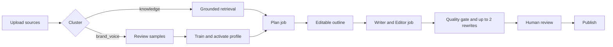

<h1 align="center">AI Content OS</h1>
<p align="center"><strong>Project-scoped, review-gated AI writing for internal content teams.</strong></p>

AI Content OS combines FastAPI, a background worker, SQLite, ChromaDB, CrewAI, LM Studio, and a Next.js operations UI. It turns approved source material into grounded blog drafts while keeping project data isolated and requiring human approval before publication.

> **Release status:** ready for an internal pilot. The fixed 25-topic quality benchmark is still outstanding, so this is not yet an unqualified public release.

## Why It Exists

The system keeps facts and writing style separate:

| Cluster | Content | Generation use |
| --- | --- | --- |
| `knowledge` | Product facts, references, and source documents | Grounds factual claims and produces citations |
| `brand_voice` | Candidate writing samples | Trains profiles only after reviewer approval with rating 4 or 5 |
| `evaluation` | Held-out evaluation material | Never used for generation |

Profiles are immutable and versioned per project. Every generation run records the exact profile version, citations, attempts, quality report, reviewer decision, and final publication state.

## Workflow


```mermaid
flowchart LR
    A[Upload sources] --> B{Cluster}
    B -->|knowledge| C[Grounded retrieval]
    B -->|brand_voice| D[Review samples]
    D --> E[Train and activate profile]
    C --> F[Plan job]
    E --> F
    F --> G[Editable outline]
    G --> H[Writer and Editor job]
    H --> I[Quality gate and up to 2 rewrites]
    I --> J[Human review]
    J --> K[Publish]
```

Planning, generation, and profile training are asynchronous. The API persists jobs in SQLite; `backend/worker.py` processes them and supports retry and crash recovery.

## Product Surface

| Route | Purpose |
| --- | --- |
| `/` | Operational dashboard |
| `/create` | Brief, planning, outline editing, generation, and quality results |
| `/review` | Content editing, scoring, approval, rejection, and publishing |
| `/rag` | Projects, source clusters, sample approval, and profile versions |
| `/blogs` | Project-scoped drafts and published posts |

Business APIs are under `/api/v1`. `GET /health` and `GET /ready` are root system endpoints.

## Quick Start

### Requirements

- Python 3.12-compatible environment
- Node.js and npm
- PowerShell 7 for multipart upload examples
- LM Studio serving `qwen3.5-2b` at `http://127.0.0.1:1234/v1`

### 1. Backend

```powershell
cd backend
python -m venv .venv
.\.venv\Scripts\python.exe -m pip install -r requirements.txt
Copy-Item .env.example .env
```

Set these values in `backend/.env`:

```env
RUN_MODE=cloud
AI_PROVIDER=openai
OPENAI_API_KEY=lm-studio
OPENAI_API_BASE=http://127.0.0.1:1234/v1
PLANNER_MODEL=qwen3.5-2b
WRITER_MODEL=qwen3.5-2b
EDITOR_MODEL=qwen3.5-2b
AUTH_ENABLED=true
ALLOW_INSECURE_AUTH=false
ENABLE_LEGACY_SYNC_API=false
INTERNAL_ACCESS_TOKENS={"REPLACE_ADMIN":{"username":"Admin","role":"admin","projects":["acme"]},"REPLACE_WRITER":{"username":"Writer","role":"writer","projects":["acme"]},"REPLACE_REVIEWER":{"username":"Reviewer","role":"reviewer","projects":["acme"]}}
```

Replace every `REPLACE_*` value with a unique secret before startup. Never commit `backend/.env`.

### 2. Frontend

```powershell
cd ..\frontend
npm install
npm.cmd run build
```

### 3. Run

From the repository root:

```powershell
cd ..
.\scripts\start_internal.ps1
```

Open `http://127.0.0.1:3000`. Check readiness at `http://127.0.0.1:8000/ready`.

Stop all processes with:

```powershell
.\scripts\stop_internal.ps1
```

For isolated local development only, set `AUTH_ENABLED=false` and `ALLOW_INSECURE_AUTH=true`, then run `start_internal.ps1 -AllowInsecureLocal`.

## Architecture

```mermaid
flowchart TB
    UI[Next.js UI] --> API[FastAPI]
    API --> AUTH[Role and project authorization]
    API --> DB[(SQLite jobs and metadata)]
    API --> VECTOR[(Chroma vectors)]
    WORKER[Background worker] --> DB
    WORKER --> VECTOR
    WORKER --> LLM[LM Studio / qwen3.5-2b]
    READY[/ready] --> DB
    READY --> VECTOR
    READY --> LLM
```

```text
backend/app/api/v1/       HTTP routers
backend/app/repositories/ SQLite persistence and state transitions
backend/app/workers/      Planning, generation, and profile jobs
backend/app/rag/          Loading, embeddings, retrieval, and Chroma
backend/worker.py         Persistent job consumer
frontend/app/             Next.js routes and shared workspace UI
scripts/                  Local production start and stop scripts
```

## Supported API Flow

The UI implements the complete workflow. For integrations, use the OpenAPI docs at `http://127.0.0.1:8000/docs`.

| Method | Route | Minimum role |
| --- | --- | --- |
| `POST` | `/projects` | admin |
| `POST` | `/documents/upload` | writer |
| `POST` | `/projects/{project}/documents/{document}/approval` | reviewer |
| `GET` | `/projects/{project}/profiles` | writer |
| `POST` | `/projects/{project}/profiles/train` | admin |
| `POST` | `/projects/{project}/profiles/{profile}/activate` | admin |
| `POST` | `/projects/{project}/generation-runs` | writer |
| `PATCH` | `/generation-runs/{run}/outline` | writer |
| `POST` | `/generation-runs/{run}/generate` | writer |
| `GET` | `/jobs/{job}` | writer |
| `POST` | `/generation-runs/{run}/review` | reviewer |
| `POST` | `/generation-runs/{run}/publish` | reviewer |

Use this polling helper for queued operations:

```powershell
function Wait-ContentJob($api, $jobId, $headers) {
  do {
    Start-Sleep -Seconds 1
    $job = Invoke-RestMethod -Uri "$api/jobs/$jobId" -Headers $headers
  } while ($job.status -in @('queued', 'running'))
  if ($job.status -ne 'succeeded') { throw ($job.error | ConvertTo-Json -Compress) }
  return $job
}
```

Profile training requires at least five `brand_voice` uploads approved by a reviewer with `human_rating` 4 or 5. Capture each upload response's `document_id`, approve those exact IDs, queue training, and wait for the returned `job.job_id` before listing and activating the new profile.

Generation follows the same pattern: create a run, wait for its planning job, edit the returned outline, queue generation, wait for the generation job, then send the run to a reviewer. Publishing is rejected until the run is approved.

### Legacy APIs

- Synchronous `/content/*` routes are disabled by default with `ENABLE_LEGACY_SYNC_API=false` and return `404`.
- Synchronous `/documents/brand-voice/*` routes are retired and return `410 Gone`.

New integrations must use project-scoped jobs and generation runs.

## Verified Evidence

| Check | Result |
| --- | --- |
| Backend suite | 50 tests passed |
| Frontend | ESLint and production build passed |
| Readiness | SQLite, Chroma, and `qwen3.5-2b` ready |
| TSS smoke | Brand 87, style 92, fingerprint 45, persona 55 |
| Grounding | 1.0 coverage, 2 citations |
| Rewrite loop | 2 targeted rewrites |
| Publication | Human approval required |

The smoke run proves the operational path, not broad writing quality. The fingerprint score of 45 remained below threshold and required reviewer judgment. Run and document the fixed 25-topic benchmark before claiming a public quality release.

## Operations

### Tests

```powershell
cd backend
.\.venv\Scripts\python.exe -m pytest

cd ..\frontend
npm.cmd run lint
npm.cmd run build
```

### Backup

```powershell
.\backend\.venv\Scripts\python.exe .\backend\scripts\backup_runtime.py backup `
  --data-dir .\backend\data `
  --config-dir .\backend\config `
  --backup-dir .\backups\contentos-YYYYMMDD
```

Restore during a maintenance window with the same script's `restore` action. `--force` replaces existing runtime destinations.

### Docker

With Docker and LM Studio running on the host:

```powershell
docker compose up --build -d
docker compose ps
docker compose down
```

`docker-compose.yml` forces secure auth settings for the API and worker. Configure real tokens in `backend/.env` before starting containers.

## Security And Release Checklist

- [ ] Authentication enabled with unique, project-scoped tokens
- [ ] Legacy synchronous APIs disabled
- [ ] Knowledge and brand samples stored in the correct clusters
- [ ] Brand samples explicitly approved and rated before training
- [ ] Intended immutable profile activated for each project
- [ ] `/ready` verifies SQLite, Chroma, and the expected model
- [ ] Backend tests, frontend lint, and production build pass
- [ ] Runtime backup created and verified
- [ ] Human review enforced before publishing
- [ ] Fixed 25-topic benchmark passed and recorded before public release

## Further Reading

- [Internal ship-ready plan](docs/superpowers/plans/2026-07-17-internal-ship-ready.md)
- [README redesign specification](docs/superpowers/specs/2026-07-18-readme-redesign-design.md)
