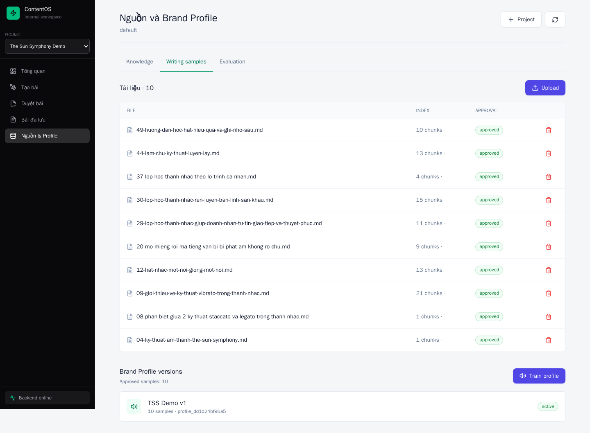
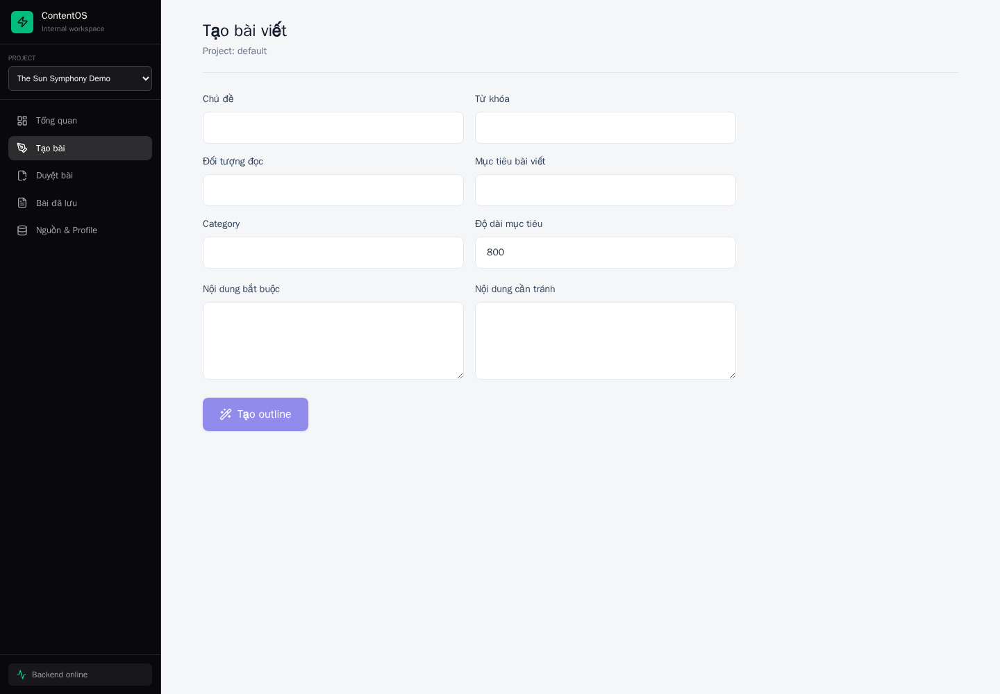
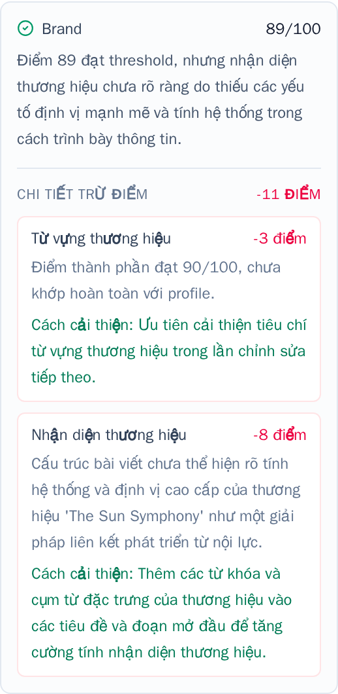

# Hướng dẫn sử dụng ContentOS

ContentOS giúp tạo bài viết dựa trên các bài mẫu, tự chấm điểm theo giọng thương hiệu và chuyển bài sang bước duyệt.

**Link truy cập:** [Mở ContentOS](https://contributive-lucinda-glabrescent.ngrok-free.dev/)

> Không cần đăng nhập hoặc nhập token. Nếu ngrok hiện trang cảnh báo ở lần mở đầu tiên, chọn **Visit Site**. Đây là link nội bộ, không chia sẻ công khai.

## 1. Chờ dữ liệu tải xong

Khi mới mở web, chờ thông báo **Đang tải workspace demo** biến mất. Sau đó kiểm tra góc dưới bên trái hiển thị **Backend online**.

Vào **Nguồn & Profile → Writing samples**. Hệ thống mẫu đã có:

- 10 writing samples ở trạng thái `approved`.
- Brand Profile `TSS Demo v1` ở trạng thái `active`.

## 2. Tạo bài viết

Vào **Tạo bài** và điền bốn ô bắt buộc: **Chủ đề**, **Từ khóa**, **Đối tượng đọc**, **Mục tiêu bài viết**. Các ô còn lại dùng để kiểm soát nội dung và độ dài.

Ví dụ có thể nhập để thử nhanh:

| Trường | Nội dung mẫu |
| --- | --- |
| Chủ đề | Cách kiểm soát hơi khi hát cho người mới |
| Từ khóa | kiểm soát hơi, hỗ trợ hơi thở, luyện thanh |
| Đối tượng đọc | Học viên thanh nhạc mới bắt đầu |
| Mục tiêu bài viết | Hướng dẫn người đọc nhận biết và cải thiện cách lấy hơi khi hát |
| Category | Kỹ thuật thanh nhạc |
| Độ dài mục tiêu | 800 |
| Nội dung bắt buộc | dấu hiệu hụt hơi, bài tập kiểm soát luồng hơi |
| Nội dung cần tránh | cam kết kết quả tuyệt đối, thuật ngữ quá hàn lâm |

Sau khi nhập xong:

1. Chọn **Tạo outline** và đợi hệ thống tạo dàn ý.
2. Đọc, sửa hoặc thêm từng dòng trong outline nếu cần.
3. Chọn **Viết và kiểm tra** rồi chờ Writer và Quality Gate hoàn tất.
4. Chọn **Chuyển sang duyệt** để kiểm tra bản cuối.

## 3. Hiểu báo cáo điểm

Mỗi nhóm bắt đầu từ **100 điểm**. Dòng **Chi tiết trừ điểm** là tổng của các khoản trừ nhỏ ngay bên dưới, không phải một lần trừ thêm.

Ví dụ: **Brand 89/100** có tổng **-11 điểm**, gồm:

- Từ vựng thương hiệu: `-3 điểm`.
- Nhận diện thương hiệu: `-8 điểm`.
- Tổng: `100 - 3 - 8 = 89`.

Điểm cuối là điểm tổng hợp của bốn nhóm:

- **Brand:** từ ngữ và nhận diện thương hiệu.
- **Style:** cách trình bày, cấu trúc và nhịp bài.
- **Fingerprint:** các thói quen viết đặc trưng từ writing samples.
- **Persona:** mức phù hợp với người đọc mục tiêu; đây là chỉ số tham khảo, không chặn bài.

Trong **Lý do chấm điểm**, mỗi khoản trừ có nguyên nhân và **Cách cải thiện**. Chọn **Vùng cần xem** để thấy đoạn văn cụ thể được hệ thống đánh dấu.

[Mở toàn bộ màn hình duyệt bài và báo cáo điểm](assets/user-guide/review-score-breakdown.png)

## 4. Duyệt và xuất bản

Trong **Duyệt bài**:

1. Chọn bài ở cột bên trái.
2. Dùng **Chỉnh sửa** để sửa nội dung hoặc **Vùng cần xem** để kiểm tra lỗi được đánh dấu.
3. Nhập **Score** và **Notes** của người duyệt.
4. Chọn **Reject** nếu cần làm lại, hoặc **Approve** nếu bài đạt yêu cầu.
5. Sau khi duyệt, chọn **Publish** để lưu bài vào **Bài đã lưu**.

Các trạng thái thường gặp: `needs_review` là đang chờ duyệt, `approved` là đã duyệt và chờ xuất bản, `published` là đã xuất bản.

## Khi gặp lỗi

- Web còn báo đang tải: chờ vài giây rồi tải lại trang một lần.
- Góc trái báo **Backend offline**: liên hệ người vận hành; không bấm tạo bài nhiều lần.
- Tạo bài lâu: giữ nguyên trang vì hệ thống có thể tự viết lại tối đa 2 lần để cải thiện điểm.
